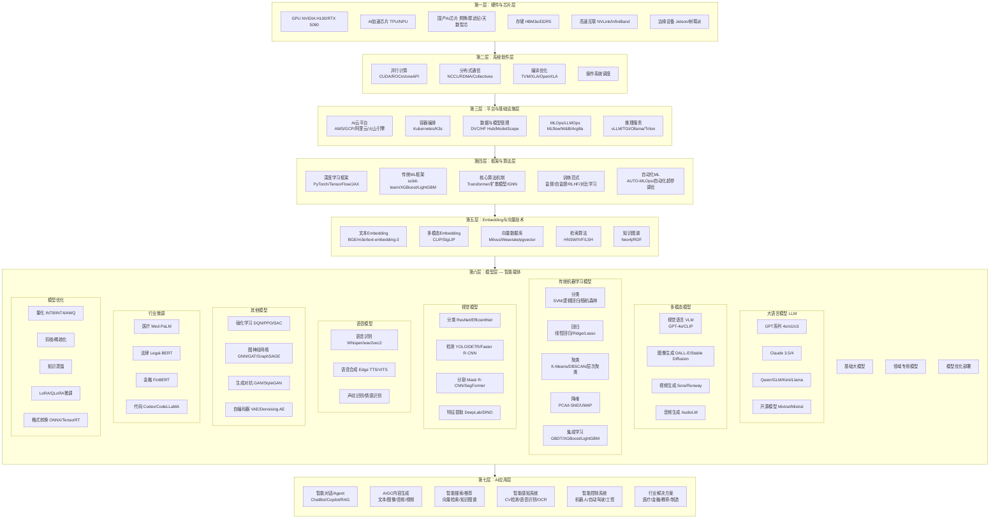

# AI技术架构全景图 — 全面调研补充

> 基于原 `2026-08-05 AI技术架构全景图.md`，本次调研补充了传统机器学习、计算机视觉、机器人/ROS、向量检索/Embedding、语音技术、强化学习、图神经网络、边缘AI等关键分支，形成完整的AI技术体系。

---

## 一、新增全景架构设计图（Mermaid v2）

在原6层架构基础上，重构为更精细的分层结构，增加横向技术能力轴：



---

## 二、横向AI技术能力轴详解

### 2.1 传统机器学习 — 十大核心算法

即使在大模型时代，传统ML仍然是工业界解决结构化数据问题的首选（高效、可解释、成本低）。

| 算法 | 类型 | 核心思想 | 典型场景 | 代表库 |
|------|------|----------|----------|--------|
| **线性回归** | 回归 | 拟合数据间的线性关系 | 房价预测、销量预测 | sklearn |
| **逻辑回归** | 分类 | Sigmoid映射到概率空间 | 垃圾邮件分类、信贷评估 | sklearn |
| **决策树** | 分类/回归 | 基于特征条件递归划分 | 规则提取、特征重要性 | sklearn |
| **随机森林** | 集成 | 多棵决策树投票/平均 | 结构化数据竞赛、特征评估 | sklearn |
| **GBDT/XGBoost** | 集成 | 梯度提升树，迭代修正残差 | Kaggle竞赛、推荐排序 | XGBoost/LightGBM |
| **支持向量机 SVM** | 分类 | 最大化分类间隔，核技巧 | 文本分类、小样本分类 | sklearn |
| **K近邻 KNN** | 分类/回归 | 距离度量，少数服从多数 | 推荐系统、异常检测 | sklearn |
| **K-Means聚类** | 聚类 | 迭代更新簇中心最小化方差 | 用户分群、图像压缩 | sklearn |
| **朴素贝叶斯** | 分类 | 贝叶斯定理+特征条件独立 | 文本分类、垃圾过滤 | sklearn |
| **PCA降维** | 降维 | 找到数据最大方差方向 | 特征压缩、可视化 | sklearn |

**其他重要传统算法：**
- **层次聚类**：树状结构聚类，适合小数据集
- **DBSCAN**：基于密度的聚类，能发现任意形状簇
- **关联规则**：Apriori/FP-Growth，购物篮分析
- **隐马尔可夫模型 HMM**：序列建模，语音识别先驱
- **CRF条件随机场**：序列标注，NER/分词

### 2.2 计算机视觉（CV）

CV是AI落地最成熟的领域之一，已从实验室走向工业级部署。

#### 2.2.1 图像分类
- **ResNet系列**：残差连接解决了深层网络退化问题
- **EfficientNet**：复合缩放平衡精度与效率
- **ViT (Vision Transformer)**：将Transformer用于图像patch序列
- **ConvNeXt**：用Transformer设计理念改造CNN

#### 2.2.2 目标检测
| 模型 | 特点 | 速度 | 精度 |
|------|------|------|------|
| **YOLOv8/v9/v10** | 单阶段检测，工业首选 | ⚡极快 | ⭐⭐⭐⭐ |
| **DETR** | 基于Transformer的端到端检测 | 中等 | ⭐⭐⭐⭐⭐ |
| **Faster R-CNN** | 双阶段检测，精度标杆 | 较慢 | ⭐⭐⭐⭐⭐ |
| **SSD/MobileNet-SSD** | 移动端检测 | 快 | ⭐⭐⭐ |

#### 2.2.3 图像分割
- **实例分割**：Mask R-CNN、YOLOv8-Segment
- **语义分割**：DeepLabV3+、SegFormer、SAM (Segment Anything)
- **全景分割**：结合实例和语义分割

#### 2.2.4 视觉基础模型
- **SAM (Segment Anything)**：Meta的零样本分割模型
- **DINO/DINOv2**：自监督视觉特征提取
- **CLIP**：图文对比学习，零样本分类
- **OpenCLIP**：CLIP开源实现
- **Florence-2**：微软统一视觉基础模型

#### 2.2.5 视频理解
- **VideoMAE**：掩码自编码器用于视频
- **TimeSformer**：Transformer用于视频分类
- **InternVL**：视觉-语言-视频多模态

### 2.3 语音与音频技术

| 技术 | 代表模型 | 用途 |
|------|----------|------|
| **语音识别 ASR** | Whisper、wav2vec2、Paraformer | 语音转文字 |
| **语音合成 TTS** | VITS、Edge TTS、ChatTTS | 文字转语音 |
| **声纹识别** | ECAPA-TDNN、x-vector | 说话人验证 |
| **语音情感识别** | OpenSMILE + CNN | 情绪分析 |
| **音频分类** | PANNs、YAMNet | 环境音/音乐分类 |
| **音乐生成** | MusicGen、Jukebox | AI作曲 |

### 2.4 向量检索与Embedding技术

这是RAG和语义搜索的技术基石。

#### 2.4.1 Embedding模型

| 类别 | 代表模型 | 特点 |
|------|----------|------|
| **文本通用** | BGE-M3、m3e、text-embedding-3 | 多语言、多粒度 |
| **视觉-文本** | CLIP、SigLIP、ALIGN | 跨模态对齐 |
| **3D/点云** | PointNet、PointTransformer | 空间数据Embedding |
| **图数据** | DeepWalk、GraphSAGE Embedding | 节点/图Embedding |
| **推荐场景** | YouTube DNN、Two-Tower | 召回排序 |

#### 2.4.2 向量数据库

| 数据库 | 语言 | 特性 |
|--------|------|------|
| **Milvus** | Go/C++ | 分布式、云原生、支持GPU加速 |
| **Weaviate** | Go | 自带向量生成、支持GraphQL |
| **pgvector** | PostgreSQL扩展 | 轻量级、SQL兼容 |
| **Qdrant** | Rust | 高性能、过滤器丰富 |
| **Chroma** | Python | 极简、嵌入友好 |
| **FAISS** | C++/Python | 纯检索引擎、Facebook出品 |
| **Elasticsearch** | Java | 混合检索(向量+关键词) |

#### 2.4.3 近似最近邻搜索算法

| 算法 | 原理 | 适用场景 |
|------|------|----------|
| **HNSW** | 分层可导航小世界图 | 实时搜索、高维数据 |
| **IVF** | 倒排索引分聚类 | 大规模数据 |
| **LSH** | 局部敏感哈希 | 近似匹配、去重 |
| **PQ** | 乘积量化 | 压缩存储、节省内存 |

### 2.5 强化学习（RL）

| 算法 | 类型 | 核心思想 | 应用 |
|------|------|----------|------|
| **Q-Learning** | 离线值迭代 | 学习状态-动作价值表 | 简单游戏 |
| **DQN** | 深度学习+Q | 用神经网络近似Q值 | Atari游戏 |
| **Policy Gradient** | 策略梯度 | 直接优化策略 | 连续动作空间 |
| **A3C** | 异步并行 | 多Worker并行更新 | 高效训练 |
| **PPO** | 截断策略梯度 | 限制策略更新步长 | RLHF核心算法 |
| **SAC** | 最大熵RL | 鼓励探索 | 机器人控制 |
| **DPO** | 直接偏好优化 | 绕过RLHF的奖励模型 | 大模型对齐 |

### 2.6 图神经网络（GNN）

| 模型 | 类型 | 适用场景 |
|------|------|----------|
| **GCN** | 图卷积 | 节点分类、链接预测 |
| **GAT** | 图注意力 | 带权重的图关系 |
| **GraphSAGE** | 采样聚合 | 大规模图、归纳学习 |
| **GIN** | 图同构网络 | 图分类 |
| **GraphRAG** | 图+RAG | 知识图谱增强问答 |

应用：社交网络分析、推荐系统、分子药物设计、交通预测

### 2.7 机器人系统与ROS

| 模块 | 技术/框架 | 说明 |
|------|-----------|------|
| **操作系统** | ROS 2 / ROS 1 / 微ROS | 机器人中间件 |
| **建图定位** | SLAM (ORB-SLAM3/Cartographer) | 同时定位与建图 |
| **路径规划** | A*/RRT*/D* | 全局/局部路径 |
| **运动控制** | PID/MPC/轨迹优化 | 精确控制 |
| **感知** | OpenCV + PCL + YOLO | 视觉+激光+深度 |
| **导航** | Nav2 (ROS 2) | 导航栈 |
| **操作** | MoveIt 2 | 机械臂控制 |
| **仿真** | Gazebo/Isaac Sim/Webots | 虚拟测试环境 |
| **模仿学习** | DAgger/CAL | 从演示中学习 |

### 2.8 OCR与文档智能

| 技术 | 代表 | 用途 |
|------|------|------|
| **文本检测** | DBNet、CRAFT | 定位文字区域 |
| **文字识别** | PaddleOCR、Tesseract、MMOCR | OCR核心 |
| **版面分析** | LayoutLM、DocFormer | 理解文档结构 |
| **表格识别** | TableTransformer | 表格结构与内容 |
| **公式识别** | LaTeX-OCR、Mathpix | 数学公式转LaTeX |
| **手写识别** | CRNN + Attention | 手写体转文字 |

### 2.9 生成对抗网络（GAN）与变分自编码器

| 模型 | 特点 | 应用 |
|------|------|------|
| **GAN** | 生成器vs判别器对抗 | 图像生成、超分辨率 |
| **StyleGAN** | 可控属性生成 | 人脸生成、风格迁移 |
| **CycleGAN** | 非配对图像转换 | 风格迁移、色彩转换 |
| **VAE** | 隐变量建模 | 生成、异常检测 |
| **Diffusion** | 逐步去噪 | 图像/音频/分子生成 |

### 2.10 边缘AI与轻量化

| 技术 | 说明 | 代表 |
|------|------|------|
| **模型压缩** | 量化/剪枝/蒸馏 | INT8量化、Channel Pruning |
| **格式转换** | 跨平台部署 | ONNX → TensorRT/TFLite/NCNN |
| **端侧推理** | 手机/嵌入式 | TFLite、ONNX Runtime Mobile |
| **NPU加速** | 专用硬件加速 | RKNN、SNPE、Core ML |
| **边缘框架** | 轻量推理引擎 | MediaPipe、OpenVINO、NNAPI |

---

## 三、对各章节的补充优化建议

### 第二层：硬件与芯片层 — 补充

在原有GPU/TPU/FPGA基础上，增加：
- **国产AI芯片**：华为昇腾(Ascend 910B/310)、寒武纪(Cambricon)、天数智芯、燧原科技
- **边缘AI芯片**：NVIDIA Jetson Orin、瑞芯微RK3588、地平线J5、高通骁龙NPU
- **光学计算**：光AI芯片（如Lightmatter）— 未来方向

### 第三层：系统软件层 — 补充

- **oneAPI**：Intel的跨架构统一编程接口
- **ROCm**：AMD的GPU计算生态
- **TVM**：Apache的深度学习编译器栈
- **OpenVINO**：Intel的推理优化工具链

### 第四层：平台与基础设施层 — 补充

- **推理服务框架**：vLLM（大模型推理）、TGI（HuggingFace推理）、Triton Inference Server
- **数据管理**：DVC (Data Version Control)、Lakehouse架构
- **监控平台**：Grafana + Prometheus for ML monitoring
- **特征存储**：Feast (Feature Store)

### 第五层：框架与算法层 — 补充

- **传统ML框架**：scikit-learn、XGBoost、LightGBM、CatBoost、Spark MLlib
- **自动化ML**：AutoGluon、TPOT、Ray Tune
- **联邦学习**：FATE、PySyft（隐私保护AI）

### 第六层：模型层 — 全面补充

这是改动最大的层次，需要补充：

**新增：传统机器学习模型**
- 结构化数据场景下，XGBoost/LightGBM仍是Kaggle和工业界的首选
- SVM在小样本高维场景仍有优势
- K-Means/DBSCAN是无监督分析的基础

**新增：完整视觉模型谱系**
- 分类 → 检测 → 分割 → 基础模型 → 视频理解

**新增：语音模型谱系**
- ASR → TTS → 声纹 → 情感 → 音乐生成

**新增：强化学习模型**
- 游戏AI → 机器人控制 → RLHF/DPO（大模型对齐）

**新增：图神经网络**
- 社交网络 → 推荐系统 → 分子设计

### 第七层：AI应用层 — 补充

**新增应用方向**：
- **智能搜索**：语义搜索 + 向量检索 + RAG
- **智能客服**：多轮对话 + 知识库 + 工单系统
- **智能制造**：缺陷检测 + 预测性维护 + 工艺优化
- **智慧城市**：交通管理 + 安防监控 + 能源优化
- **科学研究**：AlphaFold(蛋白结构)、材料发现、药物研发
- **教育**：个性化学习、AI辅导老师、自动批改

---

## 四、AI技术选型决策树

```
AI技术选型
│
├── 数据结构化？
│   ├── 是 → 传统ML (XGBoost/LightGBM)
│   └── 否 ↓
│
├── 数据类型？
│   ├── 文本 → LLM / NLP / 文本分类 / 情感分析
│   ├── 图像 → CV模型 (分类/检测/分割)
│   ├── 视频 → 视频理解 / 时序模型
│   ├── 音频 → 语音识别/合成 / 音频分类
│   ├── 图数据 → GNN / 推荐系统
│   └── 多模态 → 多模态大模型 / CLIP
│
├── 是否需要生成能力？
│   ├── 是 → 扩散模型 / GAN / LLM生成
│   └── 否 ↓
│
├── 是否需要决策能力？
│   ├── 是 → 强化学习 / 优化算法
│   └── 否 ↓
│
├── 部署环境？
│   ├── 云端 → 大模型 / 分布式推理
│   ├── 边缘 → 量化/蒸馏模型 / NPU加速
│   └── 端侧 → TFLite / ONNX Runtime / NNAPI
│
└── 实时性要求？
    ├── 毫秒级 → 小模型 / 量化 / 边缘部署
    ├── 秒级 → 常规推理
    └── 分钟级 → 离线训练 / 批量推理
```

---

## 五、关键技术趋势总结

1. **大模型通吃化**：LLM向多模态、AGI方向发展，但传统ML在特定场景不可替代
2. **AI民主化**：开源模型(HuggingFace)、低代码平台(AutoML)、一键部署
3. **推理优先**：从"训练大模型"转向"用好模型"，推理优化成为核心
4. **向量+RAG**：成为企业AI应用的标准范式
5. **端云协同**：大模型云端+小模型端侧的混合架构
6. **AI for Science**：AI加速科学研究成为新范式
7. **具身智能**：AI + 机器人 → 物理世界的智能体
