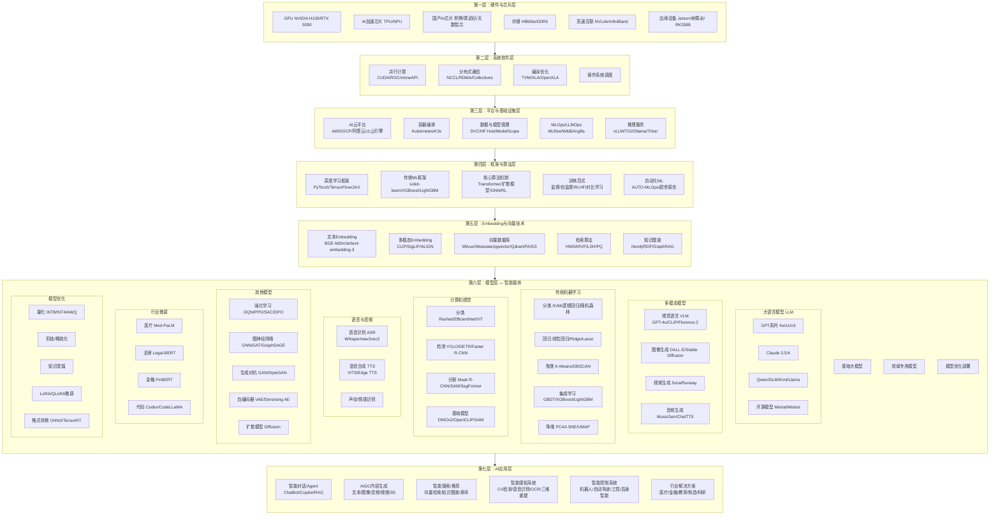

# AI技术架构全景图

## 1. 前言

> 本架构覆盖从硬件到应用的全栈AI技术，包括大语言模型、传统机器学习、计算机视觉、语音技术、机器人/ROS、向量检索/Embedding、强化学习、图神经网络等核心领域。



## 2. 硬件与芯片层（物理底座）

这是整个AI大厦的地基，负责提供算力。

### 2.1 核心芯片

- **GPU（图形处理器）**：
    - NVIDIA H100/A100：凭借数万计算核心，成为AI训练的事实标准
    - RTX 5090：消费级旗舰，适合个人开发者和小规模训练
    - NVIDIA Blackwell架构：新一代B200/GB200，支持FP4精度

- **AI加速芯片**：
    - **TPU（张量处理器）**：谷歌自研，专为矩阵乘法优化
    - **NPU（神经网络处理单元）**：终端侧芯片，如苹果MPS、高通骁龙NPU
    - **FPGA/ASIC**：用于特定场景的定制化低延迟加速

- **国产AI芯片**：
    - **华为昇腾**：Ascend 910B（训练）/310（推理）
    - **寒武纪**：Cambricon MLU370/MLU590
    - **天数智芯**：天垓100（训练）/智铠100（推理）

- **边缘AI芯片**：
    - NVIDIA Jetson Orin：边缘推理标杆
    - 瑞芯微RK3588：嵌入式AI SoC

### 2.2 关键组件

- **HBM（高带宽内存）**：HBM3e提供每秒数TB的数据吞吐，缓解"内存墙"瓶颈
- **高速互联**：NVLink（卡间）、InfiniBand（机间），用于千卡集群训练
- **未来方向**：光学AI芯片、存算一体芯片

## 3. 系统软件层（算力调度官）

负责屏蔽硬件差异，让上层软件能"无感"使用底层算力。

### 3.1 并行计算平台

- **CUDA**：NVIDIA的并行计算平台，开发者通过它直接操作GPU核心
- **ROCm**：AMD的GPU计算生态，对标CUDA
- **oneAPI**：Intel的跨架构统一编程接口（GPU/CPU/FPGA）

### 3.2 分布式通信与编译

- **NCCL**：NVIDIA集合通信库，负责多卡多机间高效同步模型参数
- **RDMA**：远程直接内存访问，降低网络延迟
- **TVM**：Apache的深度学习编译器栈，跨平台优化
- **OpenVINO**：Intel的推理优化工具链（CPU/GPU/VPU）

## 4. Embedding与向量技术（语义表示层）

这是RAG和语义搜索的技术基石，负责将数据转化为机器可理解的向量表示。

### 4.1 Embedding模型

| 类别 | 代表模型 | 特点 |
|------|----------|------|
| **文本通用** | BGE-M3、m3e、text-embedding-3 | 多语言、多粒度 |
| **视觉-文本** | CLIP、SigLIP、ALIGN | 跨模态对齐 |
| **3D/点云** | PointNet、PointTransformer | 空间数据Embedding |
| **推荐场景** | YouTube DNN、Two-Tower | 召回排序 |

### 4.2 向量数据库

| 数据库 | 语言 | 特性 |
|--------|------|------|
| **Milvus** | Go/C++ | 分布式、云原生、支持GPU加速 |
| **Weaviate** | Go | 自带向量生成、支持GraphQL |
| **pgvector** | PostgreSQL扩展 | 轻量级、SQL兼容 |
| **Qdrant** | Rust | 高性能、过滤器丰富 |
| **Chroma** | Python | 极简、嵌入友好 |
| **FAISS** | C++/Python | 纯检索引擎、Facebook出品 |

### 4.3 近似最近邻搜索算法

| 算法 | 原理 | 适用场景 |
|------|------|----------|
| **HNSW** | 分层可导航小世界图 | 实时搜索、高维数据 |
| **IVF** | 倒排索引分聚类 | 大规模数据 |
| **LSH** | 局部敏感哈希 | 近似匹配、去重 |
| **PQ** | 乘积量化 | 压缩存储、节省内存 |

### 4.4 知识图谱

- **存储**：Neo4j、RDF/SPARQL
- **与AI结合**：GraphRAG（图+RAG增强问答）、图神经网络

## 5. 框架与算法层（算法核心）

这是AI研究者的主战场，定义了模型如何"学习"。

### 5.1 深度学习框架

- **PyTorch**（研究首选）：动态计算图，调试灵活，生态最活跃
- **TensorFlow**（生产部署）：静态图，生产环境成熟
- **JAX**（科研与RL）：即时编译+自动微分，在强化学习领域受欢迎
- **MindSpore**（华为昇腾）：国产AI框架

### 5.2 传统ML框架

- **scikit-learn**：传统ML的统一接口，覆盖分类/回归/聚类/降维
- **XGBoost/LightGBM/CatBoost**：梯度提升树，结构化数据竞赛王者
- **Spark MLlib**：分布式ML，适合大数据场景

### 5.3 核心算法机制

| 机制 | 说明 | 代表应用 |
|------|------|----------|
| **Transformer** | 自注意力机制，并行计算 | LLM、ViT、多模态 |
| **扩散模型** | 逐步去噪生成数据 | 图像/音频/分子生成 |
| **卷积神经网络 CNN** | 局部感受野+权值共享 | 图像分类/检测/分割 |
| **图神经网络 GNN** | 节点/边上的消息传递 | 推荐系统、分子设计 |
| **循环神经网络 RNN/LSTM** | 时序建模 | 语音、时间序列 |
| **对抗训练 GAN** | 生成器vs判别器 | 图像生成、风格迁移 |

### 5.4 训练范式

- **监督学习**：标注数据，直接优化损失函数
- **自监督学习**：从数据自身构造监督信号（如BERT掩码预测）
- **对比学习**：拉近正样本、推远负样本（如CLIP）
- **强化学习（RLHF/DPO）**：通过人类反馈优化模型质量与安全
- **联邦学习**：隐私保护，数据不出本地（FATE、PySyft）

### 5.5 自动化ML

- **AutoGluon**：一站式AutoML
- **Ray Tune**：分布式超参调优

## 6. 模型层（智能载体）

这是普通人能感知到的"AI本体"，将算法和数据凝固为可调用的权重文件。

### 6.1 大语言模型（LLM）

| 类别 | 代表模型 | 特点 |
|------|----------|------|
| **闭源商业** | GPT-4o、Claude 3.5/4、Gemini | 性能领先、API调用 |
| **开源** | Llama 3、Qwen、GLM、Mistral、Mixtral | 可本地部署、可微调 |
| **国产** | 文心一言、Kimi、通义千问、百川、智谱 | 中文优化、合规 |

### 6.2 多模态模型

- **视觉语言VLM**：GPT-4o、CLIP、Florence-2（图文理解）
- **图像生成**：DALL-E 3、Stable Diffusion、Midjourney
- **视频生成**：Sora、Runway Gen-3、Pika
- **音频生成**：MusicGen（作曲）、ChatTTS（对话语音）

### 6.3 计算机视觉模型

| 任务 | 代表模型 | 说明 |
|------|----------|------|
| **分类** | ResNet、EfficientNet、ViT | 图像类别识别 |
| **检测** | YOLOv8/v9/v10、DETR、Faster R-CNN | 目标定位+分类 |
| **分割** | Mask R-CNN、SAM (Segment Anything)、SegFormer | 像素级分割 |
| **基础模型** | DINOv2、OpenCLIP | 零样本迁移 |
| **视频理解** | VideoMAE、TimeSformer | 时序动作识别 |

### 6.4 语音与音频模型

| 技术 | 代表模型 | 用途 |
|------|----------|------|
| **语音识别ASR** | Whisper、wav2vec2、Paraformer | 语音转文字 |
| **语音合成TTS** | VITS、Edge TTS、ChatTTS | 文字转语音 |
| **声纹识别** | ECAPA-TDNN、x-vector | 说话人验证 |
| **音乐生成** | MusicGen、Jukebox | AI作曲 |

### 6.5 传统机器学习模型

即使在大模型时代，传统ML仍是工业界解决结构化数据问题的首选（高效、可解释、成本低）。

| 算法 | 类型 | 核心思想 | 典型场景 |
|------|------|----------|----------|
| **线性回归** | 回归 | 拟合线性关系 | 房价预测、销量预测 |
| **逻辑回归** | 分类 | Sigmoid映射到概率 | 垃圾邮件分类、信贷评估 |
| **决策树** | 分类/回归 | 基于特征递归划分 | 规则提取、特征评估 |
| **随机森林** | 集成 | 多棵决策树投票/平均 | 结构化数据竞赛 |
| **XGBoost/LightGBM** | 集成 | 梯度提升树，迭代修正 | 推荐排序、风控建模 |
| **SVM** | 分类 | 最大化分类间隔 | 文本分类、小样本分类 |
| **K近邻KNN** | 分类/回归 | 距离度量，少数服从多数 | 推荐系统、异常检测 |
| **K-Means聚类** | 聚类 | 迭代更新簇中心 | 用户分群、图像压缩 |
| **朴素贝叶斯** | 分类 | 贝叶斯定理+特征独立 | 文本分类、垃圾过滤 |
| **PCA降维** | 降维 | 最大方差方向 | 特征压缩、可视化 |

**其他重要算法**：层次聚类、DBSCAN、Apriori关联规则、HMM隐马尔可夫、CRF条件随机场（序列标注/NER）

### 6.6 强化学习模型

| 算法 | 类型 | 核心思想 | 应用 |
|------|------|----------|------|
| **Q-Learning** | 离线值迭代 | 学习状态-动作价值表 | 简单游戏 |
| **DQN** | 深度学习+Q | 用神经网络近似Q值 | Atari游戏 |
| **PPO** | 截断策略梯度 | 限制策略更新步长 | RLHF核心算法 |
| **SAC** | 最大熵RL | 鼓励探索 | 机器人控制 |
| **DPO** | 直接偏好优化 | 绕过奖励模型对齐 | 大模型对齐 |

### 6.7 图神经网络（GNN）

- **GCN/GAT/GraphSAGE**：图节点分类、链接预测
- **应用**：社交网络分析、推荐系统、分子药物设计、交通预测
- **GraphRAG**：图+RAG结合，增强知识问答

### 6.8 其他生成模型

- **GAN/StyleGAN**：对抗生成，图像生成、超分辨率
- **VAE**：变分自编码器，隐变量建模、异常检测
- **扩散模型**：逐步去噪，图像/音频/分子生成（当前最主流生成架构）

### 6.9 行业微调模型

- **医疗**：Med-PaLM（医疗问答）、BioBERT（生物医学）
- **法律**：Legal-BERT（法律文本分析）
- **金融**：FinBERT（金融情感分析）
- **代码**：Codex、CodeLLaMA（代码生成）
- **OCR/文档**：LayoutLM（版面分析）、PaddleOCR

### 6.10 模型优化与部署

| 技术 | 说明 | 典型效果 |
|------|------|----------|
| **量化** | 降低精度（FP16→INT8→INT4） | 体积缩小2-4倍，速度提升 |
| **剪枝** | 移除不重要的权重连接 | 稀疏化，加速推理 |
| **知识蒸馏** | 大模型教小模型 | 保持精度的同时压缩 |
| **LoRA/QLoRA** | 低秩微调 | 只需少量参数更新 |
| **格式转换** | PyTorch → ONNX → TensorRT/TFLite | 跨平台部署 |

## 7. AI应用层（用户触达）

将模型能力封装为产品，解决实际问题。

### 7.1 交互形态

- **智能对话/Agent**：ChatBot、Copilot，能自主调用工具（查天气、写代码）
- **AIGC内容生成**：
    - 文本：ChatGPT、Claude、通义千问
    - 图像：Midjourney、DALL-E、Stable Diffusion
    - 音频：Suno（作曲）、ChatTTS（语音）
    - 视频：Sora、Runway、Pika
- **智能搜索/推荐**：语义搜索 + 向量检索 + RAG + 知识图谱

### 7.2 智能感知系统

- **计算机视觉应用**：工业质检、安防监控、人脸识别、医学影像
- **语音识别应用**：智能客服、会议转录、实时翻译
- **OCR/文档智能**：票据识别、合同分析、手写体识别
- **三维重建**：NeRF、3D Gaussian Splatting

### 7.3 智能控制系统

- **机器人**：ROS 2 + SLAM建图 + Nav2导航 + MoveIt操控
- **自动驾驶**：感知→决策→规划一体化模型
- **具身智能**：AI + 机器人，在物理世界执行任务
- **工业控制**：预测性维护、工艺优化

### 7.4 行业解决方案

| 行业 | 应用方向 |
|------|----------|
| **医疗** | AI辅助诊断、影像分析、药物研发（AlphaFold）、病历结构化 |
| **金融** | 风控建模、高频交易、智能投顾、反欺诈 |
| **教育** | 个性化学习、AI辅导老师、自动批改、知识图谱 |
| **制造** | 缺陷检测、预测性维护、工艺优化、数字孪生 |
| **农业** | 作物监测、病虫害识别、产量预测 |
| **科研** | AlphaFold（蛋白质）、材料发现、天文数据分析 |

### 7.5 RAG（检索增强生成）

应用层的重要范式，让模型在回答前先检索外部知识库，解决"幻觉"和知识过时问题。

- **架构**：文档切分 → Embedding → 向量存储 → 语义检索 → 召回增强 → LLM生成
- **增强方案**：HyDE假设性文档生成、多路召回（向量+关键词+图谱）、重排序
- **企业落地**：私有知识库、智能客服、文档问答、代码助手

## 附录 A：AI技术选型决策树

```
AI技术选型
│
├── 数据结构构化？
│   ├── 是 → 传统ML (XGBoost/LightGBM)
│   └── 否 ↓
│
├── 数据类型？
│   ├── 文本 → LLM / NLP / 文本分类 / 情感分析
│   ├── 图像 → CV模型 (分类/检测/分割)
│   ├── 视频 → 视频理解 / 时序模型
│   ├── 音频 → 语音识别/合成 / 音频分类
│   ├── 图数据 → GNN / 推荐系统
│   └── 多模态 → 多模态大模型 / CLIP
│
├── 是否需要生成能力？
│   ├── 是 → 扩散模型 / GAN / LLM生成
│   └── 否 ↓
│
├── 是否需要决策能力？
│   ├── 是 → 强化学习 / 优化算法
│   └── 否 ↓
│
├── 部署环境？
│   ├── 云端 → 大模型 / 分布式推理
│   ├── 边缘 → 量化/蒸馏模型 / NPU加速
│   └── 端侧 → TFLite / ONNX Runtime / NNAPI
│
└── 实时性要求？
    ├── 毫秒级 → 小模型 / 量化 / 边缘部署
    ├── 秒级 → 常规推理
    └── 分钟级 → 离线训练 / 批量推理
```

## 附录 B：关键技术趋势总结

1. **大模型通吃化**：LLM向多模态、AGI方向发展，但传统ML在特定场景不可替代
2. **AI民主化**：开源模型(HuggingFace)、低代码平台(AutoML)、一键部署
3. **推理优先**：从"训练大模型"转向"用好模型"，推理优化成为核心
4. **向量+RAG**：成为企业AI应用的标准范式
5. **端云协同**：大模型云端+小模型端侧的混合架构
6. **AI for Science**：AI加速科学研究成为新范式（AlphaFold、材料发现）
7. **具身智能**：AI + 机器人 → 物理世界的智能体
8. **国产替代**：国产AI芯片+框架+模型逐步完善生态链
