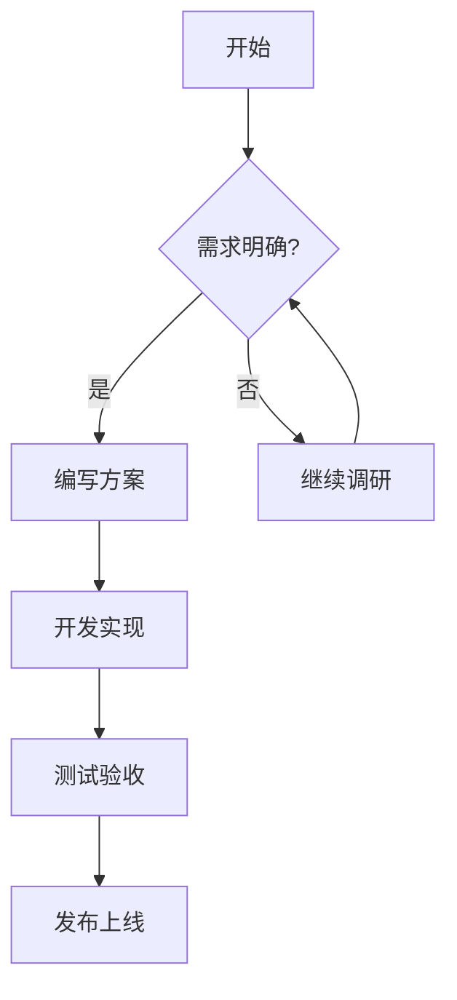
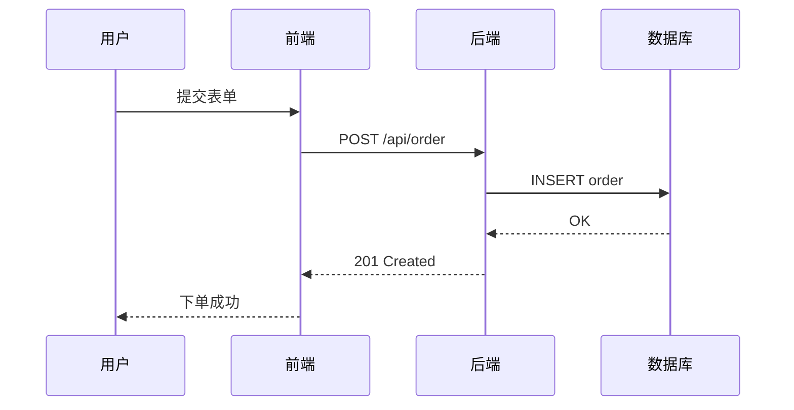
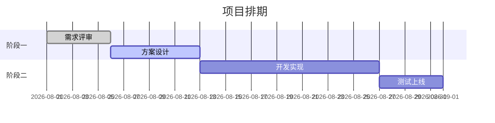
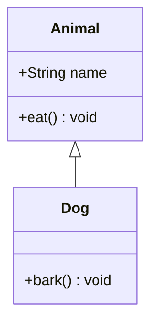
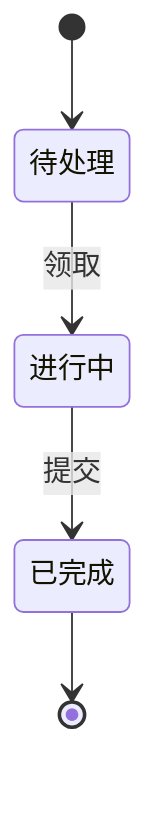
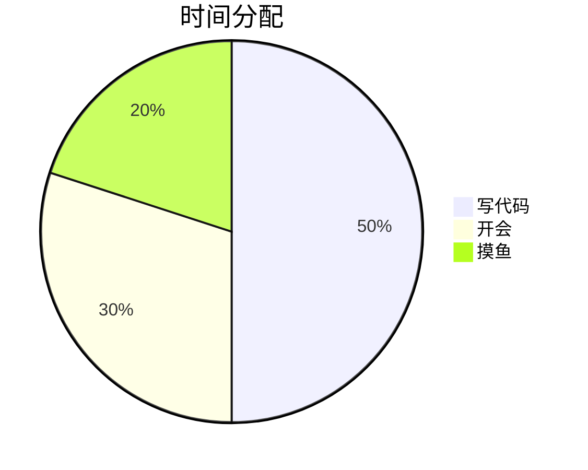

# Markdown 语法操作手册（Obsidian 增强版）

> 本手册覆盖标准 Markdown 语法与 Obsidian 扩展的全部功能特性，每个语法点均配有可直接复制使用的示例。
> 示例中的「效果预览」描述的是 Obsidian 阅读/实时预览模式下的渲染结果。

## 目录

**第一部分：标准 Markdown 语法**

1. 标题
2. 段落与换行
3. 强调（粗体 / 斜体 / 删除线）
4. 高亮
5. 列表（无序 / 有序 / 嵌套 / 任务列表）
6. 链接
7. 图片
8. 代码（行内 / 代码块 / 行号）
9. 引用
10. 水平分割线
11. 表格
12. 脚注
13. 转义特殊字符

**第二部分：Obsidian 专属特性**

14. 双链链接（Wiki Link）
15. 嵌入（Embed）
16. 标签
17. 标注块（Callout）
18. 注释
19. 数学公式（LaTeX）
20. 下标与上标
21. 剧透（隐藏文字）
22. 块级引用（Block Reference）
23. Mermaid 图表
24. Chart.js 图表
25. YAML 前置属性（Properties）
26. PDF 锚点定位
27. 模板变量
28. 搜索语法（搜索框可用）
29. 附录：常用插件语法速览（Dataview / Templater）

---

# 第一部分：标准 Markdown 语法

## 1. 标题

使用 `#` 号，从一级到六级。`#` 与文字之间必须有一个空格。

```markdown
# 一级标题
## 二级标题
### 三级标题
#### 四级标题
##### 五级标题
###### 六级标题
```

效果预览：

# 一级标题
## 二级标题
### 三级标题
#### 四级标题
##### 五级标题
###### 六级标题

> 提示：在 Obsidian 中，标题右侧悬停会出现「复制为 Wiki 链接」按钮，可直接复制该标题的锚点链接（形如 `[[本笔记#二级标题]]`）。

## 2. 段落与换行

- 段落之间空一行即为分段。
- 同一行内换行（硬换行）：行尾加两个空格再回车，或行尾加反斜杠 `\`。

```markdown
这是第一段。

这是第二段。
第一行硬换行（行尾两个空格）␠␠
第二行。
第一行硬换行（行尾反斜杠）\
第二行。
```

效果预览：

这是第一段。

这是第二段。
第一行硬换行（行尾两个空格）
第二行。
第一行硬换行（行尾反斜杠）
第二行。

## 3. 强调（粗体 / 斜体 / 删除线）

| 写法 | 符号 | 效果预览 |
| ---- | ---- | -------- |
| 粗体 | `**文字**` 或 `__文字__` | **粗体** |
| 斜体 | `*文字*` 或 `_文字_` | *斜体* |
| 粗斜体 | `***文字***` | ***粗斜体*** |
| 删除线（Obsidian 支持，非 CommonMark 标准） | `~~文字~~` | ~~删除线~~ |

示例：

```markdown
这是 **粗体**，这是 *斜体*，这是 ***粗斜体***，这是 ~~删除线~~。
注意：_ 在单词中间不会触发斜体（比如 snake_case 是安全的）。
```

## 4. 高亮（Obsidian 扩展，非标准）

Obsidian 使用 `==文字==` 实现荧光笔高亮效果。

```markdown
这是 ==高亮文字==，支持 ==**又粗又亮**== 组合。
```

效果预览：

这是 ==高亮文字==（Obsidian 中显示为黄色荧光笔效果）。

## 5. 列表

### 5.1 无序列表

使用 `-`、`*` 或 `+` 开头。

```markdown
- 苹果
- 香蕉
- 橘子
```

### 5.2 有序列表

数字加点开头，写 `1.` 连续几行即可自动递增。

```markdown
1. 第一步
2. 第二步
3. 第三步
```

### 5.3 嵌套列表

用缩进（通常 2 或 4 个空格）表示层级。

```markdown
- 前端
  - React
  - Vue
- 后端
  - Go
    - Gin
    - Echo
```

### 5.4 任务列表（Todo）

`- [ ]` 未完成，`- [x]` 已完成。Obsidian 中可直接点击复选框切换状态，并统计完成率。

```markdown
- [x] 编写需求文档
- [x] 搭建项目骨架
- [ ] 实现核心功能
- [ ] 编写单元测试
- [ ] 部署上线
```

效果预览：

- [x] 编写需求文档
- [x] 搭建项目骨架
- [ ] 实现核心功能
- [ ] 编写单元测试
- [ ] 部署上线

## 6. 链接

### 6.1 行内链接

```markdown
[Obsidian 官网](https://obsidian.md)
带提示文字的链接：[查看文档](https://help.obsidian.md "鼠标悬停显示的提示")
```

效果预览：

[Obsidian 官网](https://obsidian.md)

### 6.2 引用式链接（可选）

```markdown
访问 [官网][site] 了解更多。

[site]: https://obsidian.md
```

### 6.3 裸 URL

```markdown
直接写 https://example.com 也会被 Obsidian 识别为链接。
```

## 7. 图片

```markdown
行内图片：


指定尺寸（Obsidian 支持）：


图片宽度 200px：

```

> 在 Obsidian 中更推荐用嵌入语法 `![[图片名]]`，见第二部分第 15 节。

## 8. 代码

### 8.1 行内代码

用单个反引号包裹。

```markdown
运行 `pip install obsidian` 安装，调用 `vault.get("笔记.md")` 读取笔记。
包含反引号本身：`` 两个反引号 ` 内部可以写反引号 ``。
```

### 8.2 代码块

用三个反引号包裹，并在开头注明语言以获得语法高亮。

````markdown
```python
def hello(name: str) -> str:
    """打招呼。"""
    return f"你好, {name}!"

if __name__ == "__main__":
    print(hello("Obsidian"))
```

```bash
# Shell 示例
ls -la ~/vault
git status
```
````

### 8.3 显示行号

在围栏末尾加 `1:` 表示从第 1 行显示行号；`5:` 从第 5 行开始；`1:5` 从第 1 行显示到第 5 行。

````markdown
```python:1:4
a = 1
b = 2
c = 3
d = 4
```
````

## 9. 引用

行首加 `>` 表示引用，可嵌套、可多段。

```markdown
> 这是一段引用。
> 同一引用可以有多段，中间空一行。
>
> > 嵌套引用（再加深一层）。
>
> 引用里还可以包含 **粗体**、`代码` 和 - 列表。
> - 列表项一
> - 列表项二
```

效果预览：

> 这是一段引用。
> 同一引用可以有多段，中间空一行。
>
> > 嵌套引用（再加深一层）。

## 10. 水平分割线

三个（或以上）的 `-`、`*` 或 `_` 独占一行。

```markdown
第一段内容。

---

第二段内容。
```

> 注意：与任务列表 `- [ ]`、列表项 `-` 冲突时，分割线必须独占一行且前后有空行。

## 11. 表格

`|` 分列，第二行用 `---` 分隔表头，`:` 控制对齐。

```markdown
| 语言   | 类型     | 示例           |
| ------ | :------: | -------------: |
| Python | 动态类型 | `x = 1`        |
| Go     | 静态类型 | `x := 1`       |
| Rust   | 静态类型 | `let x = 1;`   |
```

效果预览：

| 语言   | 类型     | 示例           |
| ------ | :------: | -------------: |
| Python | 动态类型 | `x = 1`        |
| Go     | 静态类型 | `x := 1`       |
| Rust   | 静态类型 | `let x = 1;`   |

> Obsidian 增强：表格单元格内可用 `<br>` 换行；表格支持 `[[双链]]`、`#标签`、`==高亮==` 等内联语法。

## 12. 脚注

`[^1]` 定义引用点，`[^1]: 内容` 定义脚注。脚注内容写在文档末尾或任意位置均可。

```markdown
这是一个带脚注的句子[^1]，还有第二个[^note]。

[^1]: 这是第一个脚注，可以写多行，
      第二行继续内容。
[^note]: 脚注名可以用可读的单词。
```

效果预览：

正文显示为上标 `1`、`note`，点击可跳转到文末脚注并返回。

## 13. 转义特殊字符

用反斜杠 `\` 转义 Markdown 特殊字符，显示为字符本身：

```markdown
\*不是斜体\*，\#不是标题，\#不是标签，
\**不触发粗体**，\[\[不创建双链\]\]。
可转义字符：\! \* \# \+ \- \. \/ \` > [ ] ( ) ~
```

---

# 第二部分：Obsidian 专属特性

## 14. 双链链接（Wiki Link）

Obsidian 用 `[[...]]` 创建笔记间链接，是双向链接系统的核心。

### 14.1 基本链接

```markdown
今天整理了 [[读书笔记]] 里的内容，并参考了 [[2026-08-20]] 的日记。
```

效果预览：文字以带方框/主题色的链接样式显示，点击跳转；未创建的笔记显示为灰色链接，点击可直接创建。

### 14.2 链接别名

用 `|` 指定显示文字。

```markdown
详见 [[Python 高级特性|Python 指南]] 与 [[/工作/项目计划 Q3|Q3 计划]]。
```

效果预览：显示文字为「Python 指南」和「Q3 计划」，点击分别跳转到对应笔记。

### 14.3 链接到标题

`#` 后跟标题文字（标题必须已存在于目标笔记中）。

```markdown
查看 [[读书笔记#第三章 总结]]，或 [[README#安装 步骤]]。
```

### 14.4 链接到块（Block）

给任意段落/列表/引用加块 ID `^块ID`，然后链接它：

```markdown
这是目标块，它的块 ID 是 ^myblock。

在别处引用：[[读书笔记#^myblock]]
自定义短 ID：^blk1 → [[读书笔记#^blk1]]
```

> 技巧：在 Obsidian 中选中任意一段文字，按 `Ctrl/Cmd + Shift + C` 可复制该块的引用链接。

### 14.5 反向链接

不需要你额外写什么语法：只要别的笔记 `[[链接]]` 到了本笔记，本笔记底部「反向链接」面板会自动列出所有来源。这是 Obsidian 双向链路的自动机制。

## 15. 嵌入（Embed / Transclusion）

`!` + `[[...]]` 会把目标内容**原地渲染**出来（Transclusion）。

### 15.1 嵌入笔记

```markdown
![[读书笔记]]
```

效果预览：把「读书笔记.md」的全文渲染在当前光标位置；原文修改后，嵌入处自动同步更新。

### 15.2 嵌入指定标题章节

```markdown
![[读书笔记#第三章 总结]]
```

效果预览：只渲染「第三章 总结」标题下的内容。

### 15.3 嵌入指定块

```markdown
![[读书笔记#^myblock]]
```

### 15.4 嵌入图片

```markdown
![[photo.jpg]]

带说明文字：
![[photo.jpg|400x]]        ← 宽度 400px
![[photo.jpg|600x400]]    ← 宽 600 高 400
```

### 15.5 嵌入音频 / 视频

```markdown
![[会议录音.m4a]]
![[产品演示.mp4]]
```

效果预览：内嵌可播放的播放器。

### 15.6 嵌入 PDF

```markdown
![[论文.pdf]]
```

效果预览：内嵌 PDF 查看器。

### 15.7 嵌入搜索结果（Transclusion 搜索）

在嵌入中用 `#` 加搜索词，只嵌入命中该词的行（需开启「搜索嵌入内容」核心插件设置，支持 Obsidian 搜索语法）。

```markdown
![[读书笔记#TODO]]
```

效果预览：只渲染「读书笔记」中所有包含 `TODO` 的行。

## 16. 标签

行文中直接写 `#标签`。标签自动收录到「标签面板」，点击可列出全部使用该标签的笔记。

```markdown
这篇文章标记为 #读书笔记/编程 #灵感 2026-08-20。
嵌套标签：#项目/Q3/后端
```

规则：

- 标签只包含字母、数字、下划线、连字符和中文等，遇空格结束。
- 斜杠 `/` 创建嵌套层级（标签面板中显示为树形）。
- 转义 `\#` 不会创建标签。
- 建议把重要标签同时写入 YAML 前置属性（见第 25 节），便于插件筛选。

## 17. 标注块（Callout）

用引用语法 `>` 开头，第一行写 `> [!类型] 可选标题`。Obsidian 会渲染为带图标、颜色、可折叠的醒目卡片。

### 基本示例

````markdown
> [!note] 默认标注
> 这是一条普通的 note 标注。
````

````markdown
> [!tip] 小贴士
> 用 `Ctrl/Cmd + O` 快速打开笔记。
````

````markdown
> [!warning] 注意
> 此操作不可撤销，请先备份！
````

### 可折叠标注

标题行末尾加 `[+]`（默认展开）或 `[-]`（默认折叠）。

````markdown
> [!faq]- 常见问题（默认折叠）
> 问：如何折叠？答：标题末尾写 `-` 或 `+`。
````

### 全部内置类型

| 类型 | 说明 | 类型 | 说明 |
| ---- | ---- | ---- | ---- |
| `[!note]` | 笔记 | `[!success]` | 成功 |
| `[!info]` | 信息 | `[!question]` | 疑问 |
| `[!tip]` | 技巧 | `[!failure]` | 失败 |
| `[!example]` | 示例 | `[!danger]` | 危险 |
| `[!question]` | 问题 | `[!quote]` | 引用 |
| `[!warning]` | 警告 | `[!bug]` | 缺陷 |
| `[!failure]` | 错误 | `[!todo]` | 待办 |
| `[!info]` | 提示 | 自定义 `[!x-类型]` | 自定义颜色/图标 |

### 组合效果示例

````markdown
> [!success]+ 构建通过
> ```
> PASS (142 tests, 0 failures)
> ```

> [!danger] 生产环境
> 请勿直接在 prod 库执行 DDL！

> [!todo] 本周待办
> - [ ] 评审 PR #42
> - [x] 更新依赖
````

## 18. 注释

`%%...%%` 包裹的文字只在编辑模式可见，阅读模式和导出 PDF 时隐藏。适合写给自己的备忘。

```markdown
这段正文读者可见。%% 这里是我的草稿和待办，发布时会被隐藏。%% 这段也可见。
```

## 19. 数学公式（LaTeX）

- 行内公式：单 `$`，如 `$a^2 + b^2 = c^2$`。
- 块级公式：`$$` 独占，如 `$$E = mc^2$$`，支持 `\begin{...}` 环境。

示例：

```markdown
行内：勾股定理 $a^2 + b^2 = c^2$，向量 $\vec{v} = (x, y, z)$。

块级：
$$
\int_{-\infty}^{+\infty} e^{-x^2} \, dx = \sqrt{\pi}
$$

矩阵：
$$
\begin{pmatrix}
a & b \\
c & d
\end{pmatrix}
= \begin{bmatrix} 1 & 0 \\ 0 & 1 \end{bmatrix}
$$

分式与求和：
$$
f(x) = \sum_{i=1}^{n} \frac{x_i}{n}, \quad \lim_{x \to 0} \frac{\sin x}{x} = 1
$$
```

## 20. 下标与上标（Obsidian 扩展）

- 下标：`~文字~`，如 `H~2~O`
- 上标：`^文字^`，如 `x^2^`、E=mc^2^

```markdown
水分子 H~2~O，二氧化碳 CO~2~。
平方 x^2^，爱因斯坦质能方程 E=mc^2^。
```

> 注意：单字符下标/上标（如 `H~2~`）是 Obsidian 扩展语法，导出到部分外部渲染器可能失效。

## 21. 剧透（隐藏文字）

`||文字||` 渲染为覆盖的黑色色块，点击后显示。适合谜题、答案剧透。

```markdown
这道题的答案是 ||42||。
彩蛋：||其实根本没有彩蛋 :) ||
```

## 22. 块级引用（Block Reference）汇总

把第 14.4 / 15.3 节串起来，块引用的完整用法：

```markdown
目标笔记中任意段落末尾加块 ID：

这是重要结论，以后要反复引用。^conclusion

引用方式：
- 链接过去：[[目标笔记#^conclusion]]
- 嵌入过来：![[目标笔记#^conclusion]]
```

适用对象：段落、列表项、引用块、表格、代码块（代码块块 ID 写在围栏同一行或紧挨行首）。

## 23. Mermaid 图表

在 ```mermaid 代码块中写 Mermaid 语法，Obsidian 原生渲染（需开启「Mermaid 图表」核心插件）。

### 流程图

````markdown

````

### 时序图

````markdown

````

### 甘特图

````markdown

````

### 类图 / 状态图 / 饼图

````markdown





````

## 24. Chart.js 图表

```chartjs 代码块（需开启「图表（Chart.js）」核心插件）。

````markdown
```chartjs
{
  "type": "bar",
  "data": {
    "labels": ["1月", "2月", "3月", "4月"],
    "datasets": [{
      "label": "收入（万元）",
      "data": [12, 19, 15, 25],
      "backgroundColor": "rgba(54, 162, 235, 0.6)"
    }]
  },
  "options": {
    "scales": { "y": { "beginAtZero": true } }
  }
}
```
````

支持的图表类型：`bar`、`line`、`pie`、`doughnut`、`radar`、`polarArea`、`scatter`、`bubble`。完整配置项见 Chart.js 官方文档。

## 25. YAML 前置属性（Properties）

文件**最开头**用 `---` 包裹的 YAML 块。Obsidian 将其解析为结构化「属性」，显示在笔记顶部并支持排序、筛选、批量编辑（需开启「属性」核心插件）。

```markdown
---
title: 我的项目笔记
aliases: [项目笔记, Project Notes]
tags:
  - 项目
  - Q3
created: 2026-08-20
modified: 2026-08-20
status: 进行中
priority: high
due: 2026-09-30
author: honya
url: https://example.com/project
rating: 4.5
cover: cover.jpg
---

正文从这里开始。
```

常用字段说明：

| 字段 | 作用 |
| ---- | ---- |
| `aliases` | 笔记别名。用 `[[别名]]` 也能定位到本笔记 |
| `tags` | 属性形式标签，与正文 `#标签` 等效，推荐写在这里 |
| `cssclasses` | 给本篇笔记附加自定义 CSS 类（配合 CSS 代码片段换排版） |
| `created` / `modified` | 日期，属性视图可按日期排序 |
| 任意自定义键值 | 供 Dataview 等插件做结构化查询 |

> 属性值支持字符串、数字、布尔、日期、列表；字符串值可写 `true`/`false`/日期等类型化值。

## 26. PDF 锚点定位

链接或嵌入 PDF 的特定页码：

```markdown
[[论文.pdf#page=12]]
![[论文.pdf#page=3&size=80%]]
```

效果预览：点击直接打开 PDF 并定位到第 12 页；`size=80%` 控制嵌入缩放比例。

## 27. 模板变量

Obsidian「模板」核心插件支持在模板笔记中使用变量，插入模板时替换为当前值：

```markdown
{{title}}
{{date}}          ← 当前日期，如 2026-08-20
{{time}}          ← 当前时间，如 14:30
{{date:YYYY-MM-DD}}
{{date:YYYY 年 M 月 D 日}}
{{time:HH:mm:ss}}
```

日记模板示例（配合「日记」核心插件，每篇日记自动套用）：

```markdown
---
tags:
  - 日记
created: {{date}}
---

# {{date:YYYY-MM-DD}}

## 今日待办
- [ ] 

## 记录

## 复盘

```

> Templater 插件提供更强大的变量：`<% tp.file.title %>`、`<% tp.date.now("YYYY-MM-DD") %>`、`<% tp.system.prompt("输入标题") %>` 以及任意 JS 代码块。

## 28. 搜索语法（搜索框 / Ctrl+Shift+F）

在 Obsidian 搜索框（或 `![[笔记#搜索词]]` 嵌入）中可使用的运算符：

| 语法 | 含义 | 示例 |
| ---- | ---- | ---- |
| `词` | 全文包含 | `重构` |
| `^词` | 词首匹配 | `^重构` |
| `词$` | 词尾匹配 | `重构$` |
| `"精确短语"` | 完整短语 | `"双向链接"` |
| `file:名字` | 限定文件 | `file:README` |
| `path:目录` | 限定路径 | `path:工作/项目` |
| `tag:#标签` | 按标签 | `tag:项目/Q3` |
| `tag:` | 有任意标签 | `tag:` |
| `tag:[]` | 无任何标签 | `tag:[]` |
| `-词` | 排除 | `重构 -测试` |
| `a OR b` | 或 | `TODO OR FIXME` |
| `a AND b` | 且（默认就是且） | `TODO AND 重构` |
| `[property:value]` | 按属性过滤 | `[status:进行中]` |
| `[property:]` | 存在该属性 | `[due:]` |
| `[property:>-2026-09-01]` | 属性值大于日期 | `[due:>-2026-09-01]` |
| `[property::]` | 属性为空 | `[rating::]` |
| `line:(^a $b)` | 同一段落同时含 a 和 b | `line:(^需求 $评审)` |

组合示例：

```text
path:日记 tag:#日记 (TODO OR 复盘) -draft [created:><2026-08-01]
```

## 29. 附录：常用插件语法速览

### Dataview（社区插件，结构化查询笔记）

行内字段：

```markdown
status:: 进行中
due:: 2026-09-30
priority:: 高
```

查询代码块（DQL）：

````markdown
```dataview
TABLE status, due, priority
FROM "工作/项目"
WHERE status = "进行中" AND due < date(today)
SORT due ASC
```
````

表格/列表渲染（高级语法，把笔记属性当数据库用）：

````markdown
```dataviewjs
dv.table(["标题", "状态", "截止"], dv.pages('"工作/项目"').map(p => [p.file.link, p.status, p.due]));
```
````

### Templater（社区插件，模板进阶）

````markdown
<% tp.file.title %>
<% tp.date.now("YYYY-MM-DD") %>
<% tp.file.cursor(1) %>
<%*
const tags = await tp.system.prompt("输入标签（逗号分隔）");
tR += tags.split(",").map(t => "- " + t.trim()).join("\n");
-%>
<% tp.file.include("templates/常用引用.md") %>
````

### Canvas（画布，核心插件）

`.canvas` 文件是 JSON，用可视化卡片/连线组织笔记、图片、文本、网页：

```json
{
  "nodes": [
    { "id": "1", "type": "text", "x": 0, "y": 0, "width": 250, "height": 60,
      "text": "中心主题" },
    { "id": "2", "type": "file", "x": 320, "y": 0, "width": 400, "height": 400,
      "file": "读书笔记.md" }
  ],
  "edges": [
    { "id": "e1", "fromNode": "1", "toNode": "2", "label": "支撑" }
  ]
}
```

---

## 快速参考卡

| 需求 | 语法 |
| ---- | ---- |
| 链接笔记 | `[[笔记名]]` / `[[笔记名\|显示文字]]` |
| 链接章节 | `[[笔记名#标题]]` |
| 链接/嵌入块 | `[[笔记#^block]]` / `![[笔记#^block]]` |
| 嵌入笔记 | `![[笔记名]]` |
| 嵌入图片 | `![[图.jpg\|400x]]` |
| 标签 | `#标签` / `#父/子` |
| 任务 | `- [ ] 事项` |
| 高亮 | `==文字==` |
| 剧透 | `\|\|文字\|\|` |
| 标注块 | `> [!tip] 标题` |
| 隐藏注释 | `%%草稿%%` |
| 公式 | `$x^2$` / `$$...$$` |
| 上/下标 | `x^2^` / `H~2~` |
| 图表 | ` ```mermaid ` / ` ```chartjs ` |
| 属性 | 文件头 `---` YAML `---` |

> 本手册基于 Obsidian 1.x（含 1.4+ 的 Properties、chart.js 图表、transclusion 搜索等新特性）整理。核心插件若被关闭，对应语法会降级为普通文本。
