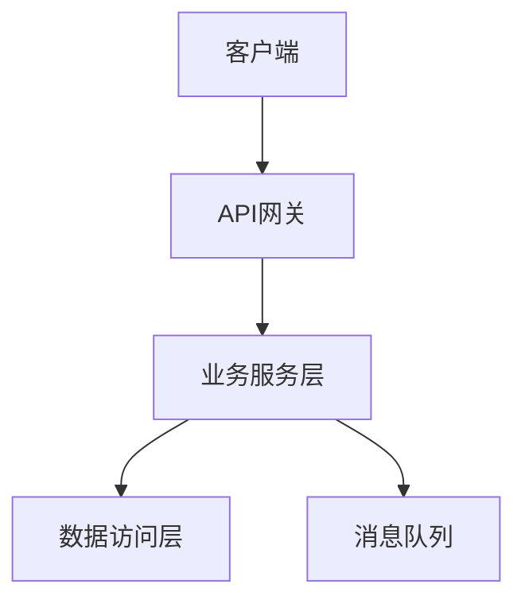

# AI coding从辅助编程走向全流程接管

## 1. 前言

从三月份接触LLM和AI Coding Agent工具以来，我的开发工作模式经历了一场静悄悄的变革。这场变革并非一夜之间的颠覆，而是四个月里日复一日的微小调整逐渐累积而成的质变。

最初只是出于好奇尝试OpenCode工具做Vibe Coding——在命令行上随手写几句功能描述，让AI生成代码。那种"意念编程"的感觉确实新奇，但很快我发现，AI的能力边界完全取决于你给出的描述有多清晰。于是我开始尝试更系统化的方法：把一个小功能的处理步骤完整写到`usecase.md`里，再喂给AI Coding Agent。从随手描述到结构化文档，这第一步看似微小，却是我工作流转变的起点。

随着实践的深入，我开始把AI工具渗透到软件开发的每一个环节：
- **客户端测试工具**：用AI自动编写，不再依赖测试人员的排期
- **模拟服务器**：用AI自动搭建，前后端联调不再互相等待
- **多环境配置文件**：批量修改让Claude一次性搞定，告别反复手动替换
- **产品原型设计**：尝试用OpenDesign + Claude取代Axure，从静态线框图到可交互原型
- **系统设计**：从PowerDesigner/StarUML的图形化操作，转向Obsidian中Mermaid/PlantUML的Markdown描述
- **运维系统**：Hermes Agent走进日常运维，自动化脚本和运维流程全面接入
- **PPT制作**：Obsidian采集资料 + Claude分析资料，自动生成演示文稿
- **RD研发文档**：用Hermes `/learn`命令制作技能，自动分析GitLab仓库中的代码和文档，一键生成RD文件

四个月的时间内，我似乎没有改变什么——用的还是同一套代码仓库、同一台电脑、同样的IDE。但一切工作习惯都改变了。AI LLM并没有被神话成无所不能的魔法师，它更像是一位极其高效但需要明确指令的执行者。它没有让我变成超级程序员，而是让我变得更"懒"了——更善于把精力集中在真正有价值的思考上，而不是消耗在重复性劳动中。

## 2. AI编程工具链：开源与商业并存的策略

### 2.1 Claude Code：主力引擎

在几款工具中，Claude Code (cc) 是我用的最强的。在相同的自建vLLM服务条件下，无论是复杂架构的重构、多文件联动的修改，还是从零搭建一个完整模块，cc总能完成任务。它的长上下文窗口、对复杂上下文的保持能力、以及对代码整体结构的理解深度，都明显优于其他工具。

我的典型用法是：把需求规格说明、系统设计文档和相关代码文件集中放在`usecase`目录下，然后让cc读取这些文件，按照步骤执行。对于大型任务，我会先用`/plan`命令让cc生成执行计划，确认无误后再用`/edit`模式执行。

### 2.2 多工具并用的防御性策略

我不会只依赖cc。原因很现实：怕Anthropic公司哪天改变策略，直接限制工具的使用，或者大幅提高价格。软件开发的自主性不应该建立在对单一商业服务的绝对依赖之上。

因此我同时使用Oh My Pi Agent (omp) 和 OpenCode (opencode) 作为补充工具链，也安装过Qwen Code、Codex、Cline等工具进行对比测试。开源工具和商业工具并用的策略，既保证了能力覆盖，也保留了选择权。

各工具的特点对比：
- **Claude Code**：推理能力强，适合复杂任务，商业服务
- **Oh My Pi Agent (omp)**：开源可自部署，适合树莓派/嵌入式等边缘设备编码，社区活跃
- **OpenCode (opencode)**：开源可自部署，适合通用日常编码，社区活跃
- **Qwen Code**：对中文理解更好，适合国内项目
- **Codex**：OpenAI生态，集成度高

### 2.3 工具链的演进方向

工具本身不是目的，工具链的效率和稳定性才是。未来的方向是：
1. 建立统一的接口抽象层，让不同AI编码工具可以无缝切换
2. 建立工具能力的自动化评估体系，根据任务类型自动选择最合适的工具
3. 本地部署的推理能力持续提升，降低对云端服务的依赖

## 3. AI编程的瓶颈：耗时80%在哪里

### 3.1 传统编程的耗时分布

在传统的手工编程流程中，手写编写代码的时间占比通常超过80%。需求分析由产品人员完成，功能测试由测试人员负责，开发工程师的核心价值被简化为"把设计文档翻译成代码"。

这种分工模式的前提是：代码编写是最耗时、最核心的环节。但这一前提在AI时代正在被颠覆。

### 3.2 AI时代的耗时重新分布

当我用AI来编程后，耗时结构发生了根本性反转：

| 阶段 | 传统模式耗时 | AI模式耗时 | 占比变化 |
|------|-------------|-----------|---------|
| 需求分析 | 产品人员1-3天 | 我亲自分析1小时 | 从"他人负责"到"我主导" |
| 系统设计 | 2-5天 (UML工具) | 1-2小时 (AI生成mermaid) | 大幅压缩 |
| 代码编写 | 3-10天 | 10-30分钟 (AI生成) | 压缩90%+ |
| 测试调试 | 2-5天 | 1-2小时 (AI辅助) | 大幅压缩 |
| 文档编写 | 1-3天 | 30分钟 (AI生成) | 压缩80%+ |

在实际的业务系统开发中，如果用AI编程，我大概花1小时来分析需求和编写需求规格说明的Markdown文档，最后喂给Claude执行。`/plan`可能只需1分钟，`/edit`执行可能也只需1分钟。编写测试工具进行测试的过程，和功能开发模式基本一致。

### 3.3 核心洞察：AI越强大，需求分析越关键

有一个深刻的体会：在实际的业务系统开发过程中，如果我们不写清楚需求说明，不写清楚执行步骤，就笼统地写上两三句，再强大的LLM也不知道我想要具体干什么。

我确实没有用过那些顶尖的闭源LLM，所以很好奇那些号称"晚上8小时自动长任务"的案例——它们背后一定有极其详尽的输入文档和明确的执行规划。至少在我的编程活动中，**需求分析、系统设计、功能流程处理的Markdown文档编写耗时占比绝对在90%以上**。我不可能晚上凌晨的时候写文档，所以根本用不着晚上让AI开工。

以前我们可以做一个简单的需求分析，然后在写代码的过程中逐步梳理业务流程。AI时代则完全不同——如果不一次性写清楚，随便写几句需求规格说明就喂给AI，那就等着之后被一堆不符合预期的代码反复折磨吧。

### 3.4 对团队角色的重新思考

这种耗时分布的变化，对团队角色分工有深远影响：
- **产品人员的价值需要重新定义**：当代码编写不再是最耗时的环节，产品分析、用户研究、业务理解的价值更加凸显
- **开发者的能力要求升级**：从"会写代码"变成"会提需求、会设计系统、会评估AI输出"
- **测试人员的定位变化**：从执行测试脚本变成设计测试策略和边界条件

## 4. 需求分析模式的转变

### 4.1 传统模式：碎片化、多系统、二进制文件

以前的需求分析流程是这样的：
1. 产品人员交给我一个Issue单和Axure界面
2. 或者第三方单位交给几份对接协议的Word文档
3. 我直接分析阅读文字和看图，然后用UML工具画用例图
4. 最后在Readme之类任务单系统界面上回复

整个过程基本涉及三到四个不同的系统：Issue管理工具、Axure原型文件、UML设计工具、任务单系统。信息碎片化，每次分析需求都要在多个工具间切换。

### 4.2 新模式：统一化、Markdown驱动、AI协同

现在的需求分析流程完全不同了：

**第一步：信息收集与格式统一**
我会用Claude、Oh My Pi Agent (omp)、OpenCode (opencode) 工具，分别把以下信息提取出来，全部转换为Markdown文件，放到系统仓库的`usecase`目录下：
- Issue单内容 → `issue-description.md`
- 产品界面截图 → 截图 + 文字说明 → `ui-specification.md`
- 对接协议Word文档 → OCR提取 + 格式化 → `integration-protocol.md`
- 历史相关代码和文档 → 直接放入目录

可能是一份MD，也可能是几份MD，但至少所有信息都在一个子文件夹里了。这是关键变化：**从多系统碎片化信息，到单一目录的聚合**。

**第二步：AI辅助需求分析**
对这些MD文档使用AI工具继续做进一步分析：
- 生成Mermaid/PlantUML用例图、时序图、活动图
- 梳理业务规则和边界条件
- 识别潜在风险和遗漏点
- 生成可执行的验收标准

### 4.3 Markdown驱动：为什么格式比工具更重要

一个重要的认知转变：**我越来越不在意用二进制文件来承载设计图了**。

传统的UML工具生成的是二进制文件（.pd, .staruml, .rpproj等），这些文件：
- 无法用Git做版本管理
- 无法用文本diff工具查看变更
- AI模型无法直接阅读
- 团队协作需要统一安装特定工具

而Markdown格式承载UML图（Mermaid/PlantUML）的优势：
- 纯文本，天然支持Git版本管理
- 任何编辑器都能查看和编辑
- AI模型可以直接读取和理解
- 可以嵌入到其他Markdown文档中，形成完整的技术文档体系
- 渲染后与二进制工具产出的图没有视觉差异

这看似是工具选择的改变，实则是**工作流范式**的转变：从"图形化工具驱动"到"文本描述驱动"，后者天然更适合AI时代。

## 5. 设计工具的范式转变

### 5.1 二十年的UML工具使用史

我用了近二十年PowerDesigner画UML图，后来切换到StarUML。无论是哪种工具，它们都有一个共同特征：二进制文件格式，图形化操作界面。

这种模式在AI出现之前是理所当然的——设计图就应该用设计工具来画。但AI时代带来了一个新的问题：**如何让AI理解并参与系统设计？**

### 5.2 Mermaid/PlantUML：AI友好的设计语言

常见做法是把需求分析MD喂给Claude，让它自动生成Mermaid/PlantUML格式的UML设计图。这些图直接嵌入在MD文档中：

这种模式的优势：
1. **设计即文档**：图不在独立的二进制文件中，就在文档里，随文档一起被Git管理
2. **AI可读可写**：AI可以直接生成、修改、分析这些图表
3. **版本可控**：每次变更都是文本diff，清晰可追溯
4. **协作友好**：不需要统一安装任何设计工具

### 5.3 从"画图"到"写设计"

这背后更深层的变化是：从前我花大量时间调整UML工具的格式、对齐、颜色、字体，现在我把这些时间省下来，花在更本质的事情上——**思考系统的结构、模块的边界、数据的流向**。

设计工具的变革不是从PowerDesigner换成StarUML，而是从"图形化绘制"转向"文本化描述"。Mermaid/PlantUML是手段，真正的革命是**系统设计过程本身被文本化和AI化**。

## 6. 产品设计的工作流创新

### 6.1 从开发者视角到产品思维

我不是产品人员，从来也没做过产品人员。但AI工具正在模糊这个界限。

过去，产品需求和开发之间的沟通过程是产品开发最大的效率杀手之一：产品写PRD，开发读PRD，开发理解后做设计，产品看设计确认，开发再实现……每个环节都有信息损耗。

### 6.2 OpenDesign + Claude：开发者的产品设计实践

现在我也尝试用OpenDesign工具配合Claude来做界面原型。流程大概是：

1. **用文字描述需求**：在Markdown中详细描述页面功能、用户操作流程
2. **Claude生成原型描述**：让Claude把文字需求转化为结构化的原型描述（可以导出为HTML线框图）
3. **OpenDesign渲染**：将描述转化为可视化的界面原型
4. **迭代修改**：直接在Markdown中调整描述，重新生成

这个流程的核心价值在于：
- **开发者直接参与产品设计**，避免了需求传递中的信息损耗
- **原型即代码**，设计变更可以直接版本管理
- **快速验证**，几分钟就能看到一个可交互的原型

### 6.3 局限性与未来展望

当然，这种模式还有局限：
- 生成的原型在交互细节和视觉精美程度上无法替代专业设计师的工作
- 对于复杂的业务规则梳理，仍然需要产品思维和经验
- AI生成的原型可能需要多次迭代才能达到可用水平

但随着AI生成能力的提升（特别是多模态模型的发展），这个流程的可行性正在快速提高。也许不久的将来，开发者只需要描述"用户想要什么"，AI就能生成可用的产品原型。

## 7. 后台系统开发：二十年编码经验的AI化

### 7.1 传统后台开发的瓶颈

这是我本质上二十年没怎么变过的工作。C++/Java/Python/Go——无非是积累了多种编程语言，但开发的本质没有变化：阅读需求、设计接口、编写代码、调试bug、优化性能。

手写了二十年，最深刻体会是：**编程能力的提升曲线在达到一定阶段后会变得非常平缓**。一个写了十年代码的工程师和一个写了二十年代码的工程师，在纯编码能力上的差距远小于他们之间的业务理解差距。

### 7.2 AI对后台开发的重构

使用AI之后，后台开发的几个核心变化：

**编码阶段被压缩**
在C++/Java/Python/Go等编程过程中，AI的编码速度和能力肯定比我强。纯coding这块基本被取代掉了——AI生成的代码在规范性、完整性、边界条件处理上通常优于手工编写。

**需求分析和系统设计成为新瓶颈**
好在需求分析和系统设计这块，没人参与AI是不可能搞定的。原因很简单：
- 真实客户对需求的描述往往是模糊的、矛盾的、不完整的
- 业务领域知识只有人类开发者才能理解
- 技术方案的权衡决策需要人类的经验和判断

**AI时代开发者的核心竞争力**
从"编码能力"转向"理解能力"和"判断能力"：
- 能否准确理解客户真实需求
- 能否设计出合理的系统架构
- 能否评估AI生成代码的质量
- 能否在复杂系统中做出正确的技术决策

## 8. 前端系统开发：从厌恶到接受

### 8.1 前端恐惧症

以前我是最厌恶前端开发的。十年前也搞过一阵子jQuery框架下的Web开发，对HTML和CSS一点不感兴趣，感觉就是写写布局、调调样式，没有技术含量。JavaScript倒是能接受，毕竟写逻辑代码的语言。

那时候最头疼的需求就是"帮我把前端也做了吧"——意味着要面对一堆标签、样式、兼容性问题，而且调试体验极差。

### 8.2 AI如何改变了我的看法

现在开始也用Claude试着写前端代码，心态发生了根本性变化：

**HTML + CSS的AI生成**
HTML和CSS本质上是结构化和样式化的描述语言。对于AI来说，这是最容易生成的代码类型之一——因为它们是**所见即所得**的，验证标准非常明确。

**TypeScript不再讨厌**
有了AI的辅助，TypeScript不再是我的敌人。AI生成的TypeScript代码在类型定义、接口设计、模块化组织上通常比我手工写的更规范。

**前后端开发流程的统一**
现在我可以：
1. 用AI同时生成后端API和前端页面
2. 用AI编写测试工具模拟用户操作
3. 前后端联调由AI辅助的自动化工具完成

这极大降低了做全栈开发的心理门槛。从前端恐惧症到"前端也不过是代码"，AI是我认知转变的催化剂。

## 9. 单元测试：从"谁写bug谁修"到AI辅助的自动化

### 9.1 坦白：过去几乎不做单元测试

有些事情不是技术难度多大，而是方不方便的事情。

在后台开发中，以前基本是手工编写单元测试，不好测试的模块常常让前端开发人员对接测试，测试人员去做集成测试，产品人员去做验收。我不会告诉你的是：**我基本上没有单元测试**。

不是不知道单元测试重要，而是：
- 手工编写测试用例耗时耗力，和写业务代码差不多
- 测试维护成本高昂，需求一变测试全废
- "谁写代码没有bug啊"——侥幸心理

### 9.2 AI如何改变单元测试生态

现在用Claude写Python测试工具很容易，构造测试数据也不难：

**AI生成测试用例的优势**
1. **自动生成边界值**：AI天然擅长列举各种边界情况
2. **Mock数据快速构造**：不需要手动编写大量测试数据
3. **测试覆盖率追踪**：AI可以根据代码覆盖率建议补充测试
4. **回归测试自动化**：需求变更后，AI可以自动更新受影响的测试用例

**实际效果**
- 一个之前没有单元测试的模块，现在AI可以在5分钟内生成完整的测试套件
- 测试用例的覆盖率和质量通常优于手工编写
- 最关键是：**测试不再是开发的负担，而是开发的自然延伸**

### 9.3 从"要不要写测试"到"怎么写好测试"

AI工具让单元测试的门槛从"需要大量时间投入"降低到"只需要描述期望行为"。这个转变的意义不亚于从手工编译到自动构建工具的出现。

未来可能的方向：
- AI根据代码变更自动生成增量测试
- AI根据生产环境监控数据发现潜在边界场景
- AI根据用户反馈自动补充异常场景测试

## 10. AI编程工具与传统编程工具的融合生态

### 10.1 工具分工：AI vs 传统

AI编程工具不再是传统IDE的替代品，而是与它们形成互补：

| 工具类型 | 代表工具 | 核心职责 | AI集成方式 |
|---------|---------|---------|-----------|
| AI编码工具 | Claude Code, Oh My Pi Agent (omp), OpenCode (opencode) | 代码生成、重构、分析 | 独立终端/CLI |
| Java开发环境 | Eclipse | Java代码阅读、编译、调试 | 作为AI的输出目标 |
| 通用编辑器 | VSCode | 多语言代码阅读、调试、Vibe Coding | 集成AI插件 |
| Python IDE | PyCharm | Python项目阅读、调试 | 远程连接AI输出 |

### 10.2 具体集成模式

**Eclipse (Java专业环境)**
- 阅读和理解大型Java项目结构
- 自动编译和构建
- AI生成的Java代码直接放入项目后在Eclipse中编译验证

**VSCode (通用开发环境)**
- 传统C++代码环境
- 前端系统HTML/CSS/TS/Vue开发
- 代码阅读、自动编译
- Vibe Coding的快速原型验证

**PyCharm (Python专业环境)**
- Python项目结构分析
- 代码阅读和调试
- AI生成Python代码后的验证和调试

### 10.3 工作流：AI + IDE的协同

典型的工作流程：
1. **需求分析阶段**：AI工具 + Markdown文档，不需要传统IDE
2. **设计阶段**：AI工具生成设计图（Mermaid/PlantUML），在Obsidian中查看
3. **编码阶段**：AI工具生成代码 → IDE中编译验证 → 发现问题 → 反馈给AI修正
4. **测试阶段**：AI生成测试代码 → IDE运行测试 → 分析测试结果
5. **部署运维**：Hermes Agent自动化执行

## 11. Obsidian：所有文档的统一入口门户

### 11.1 为什么选择Obsidian

把所有新写的文档都放到Obsidian目录下来统一管理，这是一个经过深思熟虑的选择。

核心理由：**文档统一入口门户比任何单点功能都重要**。

### 11.2 文档管理的核心原则

1. **统一格式**：自己写的文档尽量用Markdown格式，其他渠道来的文档（Word、PDF、HTML）通过AI工具转换为Markdown
2. **统一目录**：通过`mklink`软连接，把已有系统目录连接到Obsidian目录下，保证所有文档可以在一个软件界面上查看阅读
3. **统一搜索**：Obsidian的全局搜索 + 标签系统，快速定位任意文档

### 11.3 工具选择：功能 > LLM

我看重Obsidian的丰富插件生态，而不是因为它能用LLM来分析一遍得到一个关系图——这个功能虽然酷，但不是我最看重的。

Obsidian的优势插件生态：
- **Dataview**：从Markdown中提取结构化数据，构建动态视图
- **Calendar**：按日期查看文档，与工作日记天然契合
- **Templater**：模板化文档创建，保持文档格式统一
- **Excalidraw**：手绘风格的流程图和思维导图
- **Quick Add**：快速添加新笔记

### 11.4 文档即代码

Obsidian + Markdown的组合，让文档管理具备了代码管理的特性：
- Git版本控制：所有文档变更可追溯
- 交叉引用：双链笔记，文档之间建立关联
- 全局搜索：毫秒级全文检索
- 统一入口：一个软件看所有文档

## 12. Hermes Agent：所有自动化的统一入口门户

### 12.1 从个人工具到系统平台

如果说Obsidian是所有文档的入口门户，那么Hermes Agent就是所有自动化活动的入口门户。

Hermes Agent把所有开发活动和运维活动的自动化集中起来，它的强大技能体系和工具体系可以很好胜任这一切：
- **技能体系**：将重复性工作固化为可复用的技能
- **工具集成**：连接Git、CI/CD、监控系统等各种工具
- **定时任务**：Cron Job实现定时自动化
- **子代理**：Delegate Task实现并行自动化

### 12.2 典型自动化场景

**RD文档自动生成**
通过技能自动分析GitLab仓库中的代码和文档，一键生成研发文档。这是Hermes Agent最典型的应用之一——从代码仓库到研发报告，完全自动化。

**运维自动化**
服务器监控、日志分析、部署流程、故障排查等运维活动，通过Hermes Agent的技能体系和工具集成，实现半自动化甚至全自动化。

**知识库建设**
通过`/learn`命令将技术要点固化为技能，建立可复用的技术知识库。面对老旧系统，可以用Claude先分析一通，给出design.md文档，然后对局部模块单独提问——这个过程要善于提问题。

### 12.3 门户化思维：两个"门户"的价值

- **Obsidian = 文档门户**：所有文档的统一入口，解决"信息在哪里"的问题
- **Hermes Agent = 自动化门户**：所有自动化流程的统一入口，解决"怎么自动化"的问题

这两个门户的组合，构成了AI时代开发者的基础设施。

## 13. AI工具：不只是生产力工具，更是学习工具

### 13.1 作为技术学习工具

借助LLM能力和技能工具，Claude/OpenCode/OpenCode和Hermes Agent都是极好的学习工具。

**面对老旧系统的学习路径**
面对没接触过的代码系统，你可以：
1. 用Claude先整体分析一通，给出`design.md`文档
2. 对局部模块单独提问，深入了解细节
3. 让AI生成代码流程图和数据流图
4. 对不理解的概念直接问AI

这个过程的关键是：**善于提问**。AI的知识和推理能力取决于你提出的问题质量。

**专题学习资料的制作**
在Hermes Agent中可以就某个技术点制作专题学习资料。大部分情况下，这种方式比去百度找文章效率更高——虽然不能百分之百保证质量，但至少获取和整理知识变得容易了。

### 13.2 作为思维训练工具

AI工具还有一个被忽视的价值：它强迫你学会**清晰思考**。

以前写代码，思路模糊也可以凑合。现在你必须在给AI下指令之前，把需求分析清楚、把步骤写明白、把边界条件定义完整。这种"必须先想清楚再动手"的要求，反而促进了思维能力的提升。

### 13.3 AI工具学习的注意事项

1. **保持批判性思维**：AI的输出需要验证，不能盲目相信
2. **理解而非复制**：不要只复制AI生成的代码，要理解其背后的原理
3. **持续迭代**：AI工具的能力在快速演进，需要持续学习和适应

## 14. 结束语

从三月份至今的四个月，我经历了一场从"AI辅助编程"到"AI全流程接管"的转变。这场转变没有惊天动地，也没有一夜暴富式的效率提升，而是像水滴石穿一样，在每一个细节中慢慢渗透。

核心体会：
- **AI不是魔法**：它不会自动帮你思考，但它会无限放大你的思考质量
- **工具链不是越多越好**：关键是在合适的场景使用合适的工具
- **Markdown是未来的设计语言**：文本化、版本化、AI友好的格式正在取代二进制工具
- **需求分析是新的核心能力**：当代码生成变得廉价，需求分析的质量决定了最终产品的价值
- **AI是最好的学习工具**：没有之一

**ALL in AI!** 这不是口号，而是已经发生的现实。

---
*本文记录了一个有二十年开发经验的工程师在AI时代的工作流演进，希望对同样在探索AI辅助开发的同行有所启发。*
