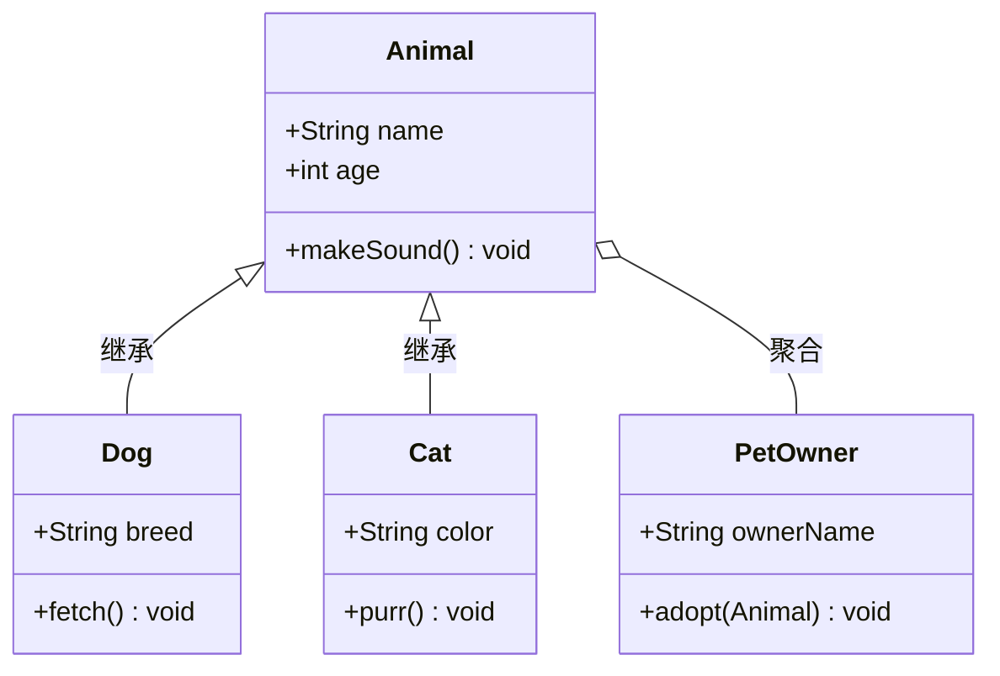
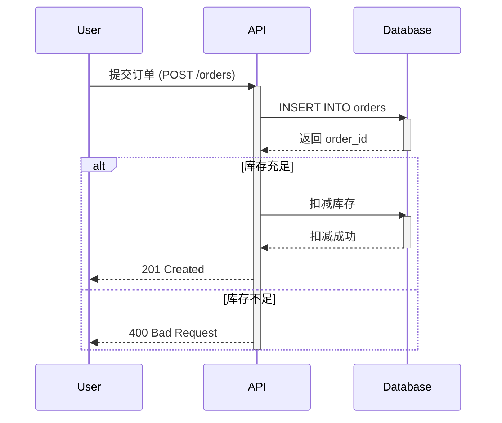
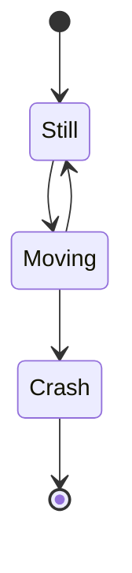
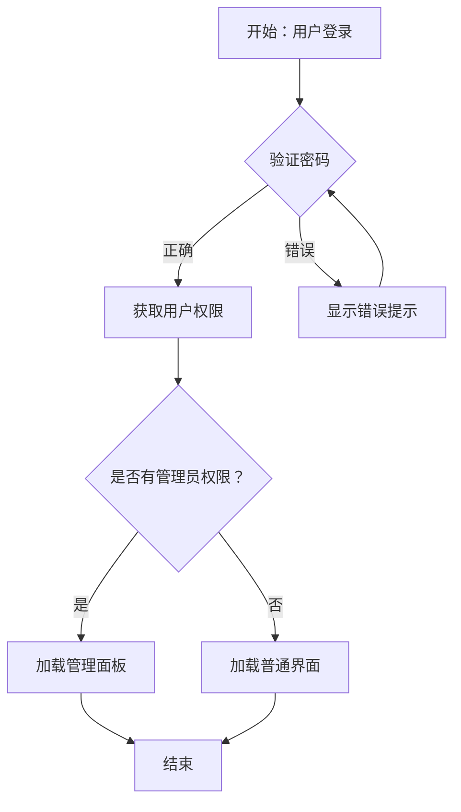
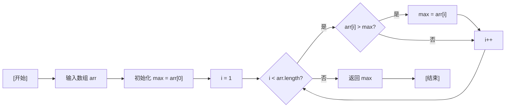
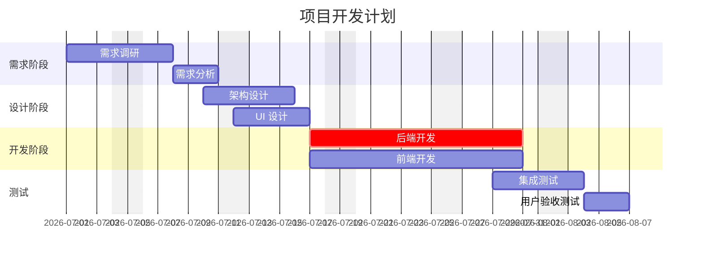
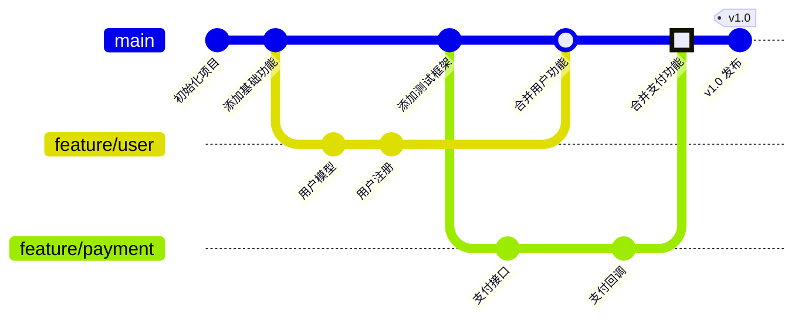
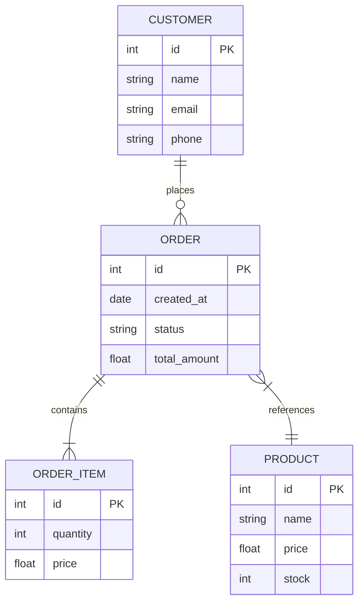
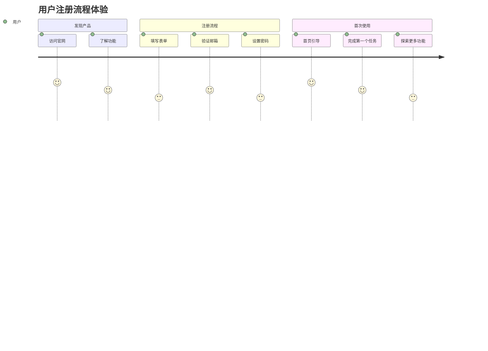

# 一个文本格式设计工具-mermaid

## 1. 前言

### Mermaid 简介

Mermaid 是一款基于 JavaScript 的开源图表和可视化工具，它使用类 Markdown 的文本定义语法，通过渲染引擎将纯文本描述转换为动态图表。Mermaid 由 Knut Sveidqvist 于 2013 年创建，旨在解决软件开发中"文档腐烂"（Doc-Rot）的痛点——传统的图表制作成本高、维护困难，导致文档往往跟不上代码迭代的速度。

Mermaid 的官方项目主页为 [https://mermaid.js.org](https://mermaid.js.org)（现已整合至 [mermaid.ai](https://mermaid.ai)），源代码托管在 GitHub（[mermaid-js/mermaid](https://github.com/mermaid-js/mermaid)）。2019 年，Mermaid 荣获 JavaScript 开源奖（JS Open Source Awards）"最令人兴奋的技术应用"类别奖项，社区活跃，拥有超过 20 万 GitHub Stars。

### 支持的 UML 标准

Mermaid 对 UML（统一建模语言）标准的支持程度如下：

| UML 图表类型 | Mermaid 支持情况 |
|---|---|
| 用例图（Use Case Diagram） | ❌ 不支持 |
| 类图（Class Diagram） | ✅ 完整支持，涵盖类属性/方法可见性、继承、组合、聚合、关联、依赖、实现、接口等 |
| 序列图（Sequence Diagram） | ✅ 完整支持，涵盖参与者、消息（同步/异步/返回）、激活条、组合片段（alt/opt/loop/par 等）、自消息等 |
| 状态图（State Diagram） | ✅ 支持，涵盖状态、转换、分叉/合并、复合状态等 |
| 活动图（Activity Diagram） | ✅ 支持，以流程图形式实现，涵盖判定、分支、并行等 |
| 组件图（Component Diagram） | ❌ 不支持 |
| 部署图（Deployment Diagram） | ❌ 不支持 |
| 对象图（Object Diagram） | ❌ 不支持 |
| 定时图（Timing Diagram） | ❌ 不支持 |

除了 UML 标准图表外，Mermaid 还支持多种非 UML 图表类型，包括：
- **流程图（Flowchart）**：支持丰富的节点形状（30+ 种）和箭头类型
- **甘特图（Gantt）**：项目管理与时间线可视化
- **Git 图（Git Graph）**：分支与提交历史可视化
- **实体关系图（ER Diagram）**：数据库模型设计
- **用户旅程图（User Journey）**：用户体验流程
- **四象限图（Quadrant Chart）**：优先级与分类分析
- **XY 图表（XY Chart）**：数据可视化

### Mermaid 的特点

1. **文本驱动**：图表定义以纯文本形式编写，天然适合版本控制（Git），支持 diff/merge，变更历史一目了然。
2. **Markdown 友好**：语法设计与 Markdown 高度兼容，可在 `.md`、`.txt` 等文件中直接嵌入，无需额外工具链。
3. **即时渲染**：通过 Mermaid Live Editor（[https://mermaid.live](https://mermaid.live)），可实时预览图表效果，支持协作编辑。
4. **广泛集成**：GitHub、GitLab、Notion、Obsidian、VS Code、Docusaurus 等主流平台均内置 Mermaid 渲染支持。
5. **灵活定制**：支持主题切换、样式自定义、方向控制（TB/BT/LR/RL）、子图嵌套等。
6. **安全渲染**：提供沙箱 iframe 渲染模式，防止恶意脚本执行。
7. **轻量级**：核心库体积小巧，可通过 CDN 直接引入，无需重型依赖。

### 文本方式设计 UML 在 AI 编程时代的优势

在 AI 辅助编程成为主流的开发范式下，基于文本的 UML 设计工具（如 Mermaid）展现出传统图形化工具无法比拟的优势：

| 维度 | 图形化 UML 工具 | 文本 UML（Mermaid） |
|---|---|---|
| **版本控制** | 二进制格式，无法 diff | 纯文本，Git 友好，精确追踪变更 |
| **AI 协作** | 难以直接理解 | AI 可直接读取、生成、修改文本定义 |
| **编辑效率** | 拖拽操作，复杂图表耗时 | 键盘输入，结构化语法，快速迭代 |
| **可移植性** | 依赖特定工具或格式 | 跨平台，任何文本编辑器可用 |
| **自动化** | 难以集成到 CI/CD | 可脚本化，支持批量生成与测试 |
| **审查效率** | 需打开专用工具查看 | PR 中直接 inline diff，代码审查一目了然 |

**具体场景：**

1. **AI 生成图表**：开发者可通过自然语言描述需求（如"生成一个订单处理的序列图"），AI 助手直接输出 Mermaid 语法，无需手动拖拽节点。
2. **需求到代码的无缝流转**：Mermaid 定义可作为"可执行文档"，与代码同步更新，避免需求与实现脱节。
3. **自动化测试**：图表定义可纳入单元测试，验证模型一致性（如检查类图与代码是否匹配）。
4. **协作设计**：团队成员在 PR 中讨论图表变更，AI 可辅助审查逻辑完整性，减少沟通成本。
5. **文档即代码**：Mermaid 图表与 README、API 文档等一体管理，确保文档始终与实现保持同步。

在 AI 编程时代，"文本即接口"的理念被重新诠释——当 AI 成为主要协作者时，以文本为载体的设计工具不仅能被人类高效使用，也能被 AI 深度理解、自动生成、动态修改，形成从需求描述到图表、再到代码的闭环工作流。Mermaid 正是这一范式的最佳实践。

## 2. 类图

类图（Class Diagram）是 UML 中最常用的静态结构图，用于描述系统的类及其相互关系。Mermaid 完整支持类图语法，包括类定义、属性可见性、方法、继承、实现、聚合、组合等。

**说明**：示例定义了 `Animal` 基类及其子类 `Dog` 和 `Cat`，展示了继承关系（`<|--`）。`PetOwner` 类与 `Animal` 形成聚合关系（`o--`），表示所有者拥有动物但生命周期独立。类成员使用 `+` 表示公有可见性。

## 3. 序列图

序列图（Sequence Diagram）描述对象之间的交互顺序，重点展示消息传递的时间顺序。Mermaid 支持参与者、同步/异步消息、返回消息、激活条、组合片段（alt/opt/loop/par）等完整语法。

**说明**：示例展示了用户提交订单的完整交互流程。`->>` 表示同步消息，`-->>` 表示返回消息。`alt...else...end` 组合片段用于条件分支（库存充足/不足），`activate/deactivate` 控制对象激活条的显示。
## 4. 状态图

状态图（State Diagram）描述单个对象在其生命周期内状态的变化，以及触发状态转换的事件。Mermaid 支持状态、转换、分叉/合并、复合状态等。

**说明**：示例展示最简单的状态转换。`[*]` 表示初始/终止状态，`-->` 表示状态转换。`stateDiagram-v2` 是 Mermaid 新版状态图语法，语法更简洁，兼容性更好。如需嵌套子状态，可在 Still 内部定义更复杂的逻辑。
## 5. 活动图

活动图（Activity Diagram）类似流程图，但更强调并发分支和泳道（角色分工）。Mermaid 以流程图语法实现活动图，支持判定、分支、并行分支等。

**说明**：示例展示登录流程。菱形节点 `{}` 表示判定节点，`|正确|`/`|错误|` 标注分支条件。密码错误时循环回验证节点，形成重试逻辑。
## 6. 流程图

流程图（Flowchart）是 Mermaid 最核心的图表类型，支持丰富的节点形状和连接方式。可用于描述算法、业务流程、数据处理等任意顺序逻辑。

**说明**：示例展示查找数组最大值算法。`LR` 表示从左到右布局。圆角矩形表示处理步骤，菱形表示判定，双圆圈表示开始/终止。箭头方向清晰展示算法循环结构。
## 7. 甘特图

甘特图（Gantt Chart）用于项目管理和时间线可视化，展示任务安排、持续时间、依赖关系和里程碑。Mermaid 甘特图支持日期格式、任务分段、进度百分比等。

**说明**：示例展示完整项目开发计划。`dateFormat` 定义日期格式，`excludes` 排除非工作日。任务使用 `section` 分组，`crit` 标记关键路径任务。任务依赖通过 `after a1` 语法声明。
## 8. Git 图

Git 图（Git Graph）可视化 Git 分支和提交历史，展示分支创建、合并、标签等操作。Mermaid 自动生成提交哈希和提交信息占位符。

**说明**：示例展示典型 Git 分支工作流。`branch` 创建分支，`checkout` 切换分支，`merge` 合并分支。`HIGHLIGHT` 类型加粗合并提交，`tag` 为提交添加标签。
## 9. 实体关系图

实体关系图（ER Diagram）用于数据库设计，描述实体、属性和关系。Mermaid ER 图支持主键、外键、基数关系（1:1、1:n、n:m）等。

**说明**：示例展示电商数据库核心模型。`||--o{` 表示一对多关系（一个客户多个订单），`||--|{` 表示一对多关系（一个订单多个订单项），`}|--||` 表示多对一关系。`PK` 标记主键。
## 10. 用户旅程图

用户旅程图（User Journey）描述用户在使用产品或服务的体验流程，强调情绪变化和关键触点。Mermaid 的 Journey 图表类型专为 UX 设计打造。

**说明**：示例展示用户注册旅程。每个节（`section`）代表一个阶段，条目后的数字（1-5）表示用户满意度评分。`用户` 标注参与者角色。用于 UX 设计和用户研究。
