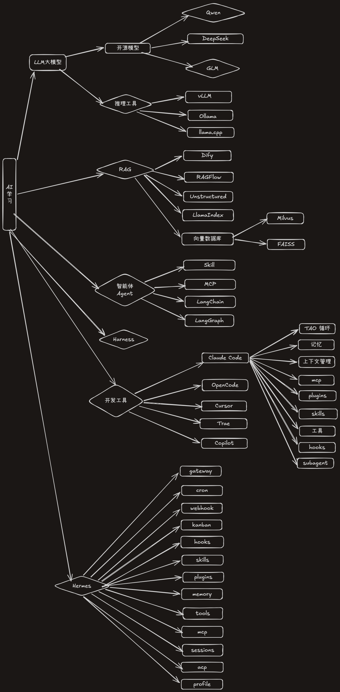

# Excalidraw 插件是一个手绘风格的绘图工具

## 1. 前言

Excalidraw 是一款开源的虚拟白板工具，以独特的「手绘风格」著称。它让开发者、产品经理、设计师等角色可以用一种轻松、非正式的方式绘制 diagrams（流程图、架构图、 wireframes 等），降低了"画出一张漂亮图表"的心理门槛。

Excalidraw 官方地址：[https://excalidraw.com](https://excalidraw.com)
GitHub 仓库：[https://github.com/excalidraw/excalidraw](https://github.com/excalidraw/excalidraw)
开发文档：[https://docs.excalidraw.com](https://docs.excalidraw.com)

截至 2026 年 7 月，GitHub 星标数超过 127,000，Fork 超过 14,000，采用 MIT 开源许可证，是目前最流行的开源绘图工具之一。

---

## 2. 技术栈与架构

### 2.1 核心技术

| 维度 | 技术选型 |
|------|----------|
| 编程语言 | TypeScript |
| UI 框架 | React 19 |
| 渲染方式 | Canvas 2D（无限画布） |
| 构建工具 | Webpack / Vite |
| 包管理 | npm（`@excalidraw/excalidraw`） |
| 国际化 | Crowdin 多语言支持 |
| CI/CD | GitHub Actions + Vercel 部署 |

### 2.2 整体架构

Excalidraw 采用分层架构设计：

```
┌─────────────────────────────────────────────────┐
│                  Host Application               │
│  (excalidraw.com / VS Code / Obsidian / 自研 App)│
├─────────────────────────────────────────────────┤
│              Excalidraw React Component          │
│  ┌───────────┐ ┌──────────┐ ┌────────────────┐ │
│  │  Renderer │ │  Editor  │ │   Collaboration │ │
│  │ (Canvas)  │ │ (Tools)  │ │    (Socket)     │ │
│  └───────────┘ └──────────┘ └────────────────┘ │
│  ┌──────────┐ ┌──────────┐ ┌────────────────┐ │
│  │  Element │ │  Library │ │    Export       │ │
│  │  Model   │ │ Manager  │ │   (PNG/SVG/JSON)│ │
│  └──────────┘ └──────────┘ └────────────────┘ │
├─────────────────────────────────────────────────┤
│         @excalidraw/excalidraw npm Package       │
└─────────────────────────────────────────────────┘
```

核心组件：

- **Renderer（渲染器）**：基于 HTML5 Canvas 2D API 的渲染引擎，负责将所有元素绘制为手绘风格图形。这是 Excalidraw 最核心的技术实现。
- **Editor（编辑器）**：管理工具栏状态（矩形、椭圆、菱形、箭头、线条、自由绘制、橡皮擦、文本选择等），处理用户交互事件（pointer down/move/up）。
- **Element Model（元素模型）**：基于 JSON 的数据模型，存储画布上所有图形的类型、位置、尺寸、颜色等属性。
- **Collaboration（协作层）**：通过 WebSocket 实现实时多人协作，使用 CRDT（冲突无复制数据类型）保证一致性。

---

## 3. 手绘风格渲染技术原理

### 3.1 核心技术思路

Excalidraw 的手绘风格并非简单地使用某种字体，而是通过**对标准几何图形进行算法扰动**实现的。其核心原理：

1. **轮廓抖动（Jittering）**：对矩形的四条边、圆的圆周、菱形的轮廓进行随机的微小偏移，使线条不完美直。
2. **平滑扭曲（Smoothing）**：使用改进的曲线平滑算法，使线条像人手绘制一样有自然的轻微弯曲。
3. **笔触纹理（Stroke Texture）**：线条的边缘带有不规则的"毛边"效果，模拟真实笔触的墨迹扩散。
4. **填充不完美（Imperfect Fill）**：填充区域的颜色并非纯色均匀分布，而是带有轻微的纹理变化。

### 3.2 关键渲染管线

```
用户绘制元素 → 获取基础几何参数 (x, y, w, h, angle)
              ↓
         应用手绘算法扰动
              ↓
         生成手绘版 SVG Path
              ↓
         Canvas 2D 渲染
              ↓
         应用到所有元素类型
         (矩形/圆/菱形/箭头/线条/文字/图像)
```

具体来说，Excalidraw 的渲染引擎会对每个元素执行以下处理：

- **矩形**：将四条直线分解为多个线段，每个线段的端点施加随机偏移
- **椭圆**：沿圆周采样多个点，每个点沿法线方向施加随机偏移
- **箭头**：线条部分应用抖动，箭头头部保持基本形状但边缘也做扰动
- **文字**：文本渲染使用系统字体，但轮廓同样做轻微抖动处理
- **自由绘制**：直接使用贝塞尔曲线插值，保留用户的原始笔触轨迹

### 3.3 性能优化

由于每个元素都需要经过手绘算法处理，渲染性能至关重要：

- **Canvas 2D 缓存**：对静态元素进行离屏渲染缓存，避免重复计算
- **视口裁剪（Viewport Culling）**：只渲染当前视口可见区域内的元素
- **增量更新**：仅重绘发生变化的元素，而非整个画布
- **Web Worker 预处理**：部分计算密集型的手绘算法可在 Worker 线程中执行

---

## 4. 元素数据模型

### 4.1 JSON 格式

Excalidraw 使用纯文本 JSON 作为数据格式（`.excalidraw` 文件），格式简洁且可读写：

```json
{
  "type": "excalidraw",
  "version": 2,
  "source": "https://excalidraw.com",
  "elements": [
    {
      "id": "pologsyG-tAraPgiN9xP9b",
      "type": "rectangle",
      "x": 928,
      "y": 319,
      "width": 134,
      "height": 90,
      "strokeColor": "#000000",
      "background": "transparent",
      "strokeStyle": "solid",
      "fillStyle": "hachure",
      "strokeWidth": 2,
      "angle": 0,
      "roundness": { "type": 2 },
      "groupIds": [],
      "locked": false,
      "customData": {
        "customId": "162"
      }
    }
  ],
  "appState": {
    "gridSize": 20,
    "viewBackgroundColor": "#ffffff",
    "theme": "light",
    "name": "My Diagram"
  },
  "files": {
    "3cebd7720911620a3938ce772436296149da03861": {
      "mimeType": "image/png",
      "id": "3cebd7720911620a3938ce772436296149da03861",
      "dataURL": "data:image/png;base64,iVBOR...",
      "created": 1690295874454,
      "lastRetrieved": 1690295874454
    }
  }
}
```

### 4.2 元素类型

Excalidraw 支持多种元素类型：

| 类型 | 说明 |
|------|------|
| `rectangle` | 矩形（支持圆角） |
| `ellipse` | 椭圆/圆形 |
| `diamond` | 菱形 |
| `arrow` | 箭头（支持绑定元素、添加标签） |
| `line` | 自由线条 |
| `freedraw` | 自由手绘区域 |
| `text` | 文本框 |
| `image` | 插入的图片 |
| `frame` | 画框（用于分组和聚焦） |
| `selection` | 选区（运行时） |

每种元素都有完整的属性集，包括位置（`x`, `y`）、尺寸（`width`, `height`）、旋转角度（`angle`）、描边颜色（`strokeColor`）、填充样式（`fillStyle`）、笔触样式（`strokeStyle`）、笔触宽度（`strokeWidth`）等。

### 4.3 元素间的关系

- **箭头绑定（Arrow Binding）**：箭头可以绑定到元素的边缘，当元素移动时箭头自动跟随
- **分组（Grouping）**：多个元素可以组合为逻辑组
- **框架（Frames）**：Frame 是一种特殊的容器元素，可以将子元素框起来，支持命名、聚焦视图

---

## 5. 核心功能特性

### 5.1 工具集

Excalidraw 提供完整的绘图工具：

- **选择工具**：框选、多选、按住 Shift 多选
- **箭头工具**：支持箭头绑定、标签文字
- **矩形 / 椭圆 / 菱形**：基础几何图形
- **线条工具**：支持实线、虚线、点线
- **手绘工具**：自由绘制，带手绘风格效果
- **橡皮擦**：擦除元素或部分笔触
- **文本工具**：在画布上添加文字
- **图片插入**：支持拖拽上传、粘贴剪贴板图片
- **手绘风格切换**：可以关闭手绘效果，切换为"完美图形"模式

### 5.2 协作功能

- **实时协作**：多人同时编辑同一个画布，光标位置实时可见
- **端到端加密（E2E Encryption）**：协作内容在客户端加密，服务端无法读取
- **PWA 支持**：可安装为渐进式 Web 应用，支持离线使用
- **本地优先（Local-first）**：自动保存到浏览器 LocalStorage
- **可分享链接**：生成只读链接，一键分享给他人

### 5.3 导出能力

| 格式                       | 说明                           |
| ------------------------ | ---------------------------- |
| `.excalidraw` (JSON)     | 可编辑的源文件格式，保留全部元素数据           |
| PNG                      | 位图导出，支持透明背景                  |
| SVG                      | 矢量图导出，可进一步编辑                 |
| 剪贴板                      | 直接复制到剪贴板                     |
| GitHub Flavored Markdown | 嵌入到 GitHub Issue/PR/README 中 |

例子: 

---

## 6. 集成与扩展

### 6.1 NPM 包集成

Excalidraw 提供了 `@excalidraw/excalidraw` NPM 包，可以嵌入到任意 React 应用中：

```bash
npm install react react-dom @excalidraw/excalidraw
```

```jsx
import { Excalidraw } from "@excalidraw/excalidraw";
import "@excalidraw/excalidraw/index.css";

function App() {
  return (
    <div style={{ height: "500px" }}>
      <Excalidraw
        initialData={{
          elements: [
            {
              type: "rectangle",
              x: 100,
              y: 100,
              width: 200,
              height: 150,
            },
          ],
        }}
        onChange={(elements) => console.log(elements)}
      />
    </div>
  );
}
```

**关键 Props API：**

| Prop | 类型 | 说明 |
|------|------|------|
| `initialData` | `object \| null` | 初始数据，可预置元素和 appState |
| `onChange` | `function` | 元素变更回调，用于持久化 |
| `excalidrawAPI` | `function` | 获取 Excalidraw 实例 API |
| `isCollaborating` | `boolean` | 是否启用协作模式 |
| `viewModeEnabled` | `boolean` | 是否启用查看模式（隐藏编辑工具） |
| `zenModeEnabled` | `boolean` | 是否启用禅模式（隐藏所有 UI） |
| `gridModeEnabled` | `boolean` | 是否显示网格 |
| `theme` | `"light" \| "dark"` | 主题 |
| `langCode` | `string` | 语言代码 |
| `onPointerUpdate` | `function` | 鼠标指针位置回调 |
| `onLibraryChange` | `function` | 库变更回调 |
| `renderTopRightUI` | `function` | 自定义右上角 UI |

**Next.js 适配：** 由于 Excalidraw 不支持服务端渲染（SSR），需要使用动态导入：

```jsx
import dynamic from "next/dynamic";

const Excalidraw = dynamic(
  async () => (await import("@excalidraw/excalidraw")).Excalidraw,
  { ssr: false }
);
```

### 6.2 样式定制

Excalidraw 使用 CSS 变量驱动主题，可以深度定制：

```css
.your-app .excalidraw {
  --color-primary: #fcc6d9;
  --color-primary-darker: #f783ac;
  --color-primary-darkest: #e64980;
  --color-primary-light: #f2a9c4;
}

.your-app .excalidraw.theme--dark {
  --color-primary: #d494aa;
  --color-primary-darker: #d64c7e;
}
```

### 6.3 主流集成

| 集成平台 | 说明 |
|----------|------|
| **VS Code 扩展** | [pomdtr.excalidraw-editor](https://marketplace.visualstudio.com/items?itemName=pomdtr.excalidraw-editor)，在编辑器中直接绘制图表 |
| **Obsidian 插件** | [zsviczian/obsidian-excalidraw-plugin](https://github.com/zsviczian/obsidian-excalidraw-plugin)，知识管理中的绘图能力 |
| **Google Cloud** | Google Cloud 架构图中直接嵌入 Excalidraw |
| **Meta** | Meta 内部使用 Excalidraw 进行系统设计 |
| **Notion** | Notion 中嵌入 Excalidraw 画布 |
| **Slite** | 团队知识库中集成 Excalidraw |
| **Replit** | 在线 IDE 中集成 Excalidraw |
| **CodeSandbox** | 在线沙箱中的可视化编辑 |
| **HackerRank** | 面试编程题中的绘图交互 |

---

## 7. 高级功能

### 7.1 Mermaid 转 Excalidraw

Excalidraw 提供了 `@excalidraw/mermaid-to-excalidraw` 包，可以将 Mermaid 流程图语法转换为 Excalidraw 元素：

```typescript
import { parseMermaidToExcalidraw } from "@excalidraw/mermaid-to-excalidraw";
import { convertToExcalidrawElements } from "@excalidraw/excalidraw";

const { elements, files } = await parseMermaidToExcalidraw(`
  flowchart TD
    A[Christmas] -->|Get money| B(Go shopping)
    B --> C{Let me think}
    C -->|One| D[Laptop]
    C -->|Two| E[iPhone]
    C -->|Three| F[Car]
`);

const excalidrawElements = convertToExcalidrawElements(elements);
```

支持的 Mermaid 类型：
- **Flowchart（流程图）**：完全支持，矩形、圆形、菱形、箭头自动转换
- **Subgraph（子图）**：转换为分组元素
- 其他类型（ER 图、Git 图、时序图等）：降级为图片嵌入

### 7.2 Frames（画框）

Frames 是 Excalidraw 的高级功能，允许将相关元素分组并命名：

```json
[
  "other_element",
  "frame1_child1",
  "frame1_child2",
  "frame1",         ← Frame 本身
  "frame2_child1",
  "frame2_child2",
  "frame2"          ← 另一个 Frame
]
```

Frames 的用途：
- **视觉分组**：将一组元素框在一起，形成逻辑单元
- **视图聚焦**：双击 Frame 可以放大到该区域，方便在大量元素中导航
- **命名组织**：每个 Frame 可以命名，便于理解 diagram 的结构

### 7.3 形状库（Shape Libraries）

Excalidraw 支持自定义形状库，用户可以：
- 创建自己的形状组合并保存到库中
- 从 [libraries.excalidraw.com](https://libraries.excalidraw.com) 社区共享库中安装
- 通过 `onLibraryChange` 回调持久化库数据

### 7.4 自定义数据（Custom Data）

每个元素都支持 `customData` 对象，可以存储任意额外信息：

```json
{
  "type": "rectangle",
  "id": "oDVXy8D6rom3H1-LLH2-f",
  "customData": {
    "customId": "162",
    "version": "1.0",
    "author": "user@example.com"
  }
}
```

---

## 8. 数据安全与隐私

### 8.1 端到端加密

Excalidraw 的协作模式使用端到端加密（E2E Encryption）：

```
用户 A → 加密 → 服务端 → 加密 → 用户 B
用户 B → 加密 → 服务端 → 加密 → 用户 A
```

- 所有数据在客户端加密后传输
- 服务端仅存储加密数据，无法解密
- 分享链接基于加密通道
- 使用 AES-GCM 加密算法

### 8.2 开放数据格式

`.excalidraw` 文件是纯 JSON 文本格式，具有以下优势：
- **可版本控制**：可以放入 Git 仓库，追踪 diagram 的变更历史
- **可互操作**：任何程序都可以读写该格式
- **无厂商锁定**：不依赖任何特定平台或云服务

---

## 9. 性能与工程考量

### 9.1 渲染性能

| 优化策略 | 说明 |
|----------|------|
| Canvas 离屏缓存 | 静态元素预渲染到离屏 Canvas，减少重复计算 |
| 视口裁剪 | 仅渲染可见区域内的元素，避免绘制画布外内容 |
| 增量重绘 | 元素变动时仅重绘受影响区域 |
| 元素数量限制 | 大量元素时启用 LOD（Level of Detail）降级 |

### 9.2 大型文件处理

对于包含数千个元素的复杂 diagram：
- 使用虚拟滚动技术分页加载
- 对图像元素启用懒加载
- 导出时按视口范围分批处理

---

## 10. 与其他工具的对比

| 特性 | Excalidraw | Figma | Draw.io | Miro |
|------|-----------|-------|---------|------|
| 开源 | ✅ MIT | ❌ | ✅ | ❌ |
| 手绘风格 | ✅ 核心特色 | ❌ | ❌ | ❌ |
| 离线使用 | ✅ PWA | ❌ | ✅ | ❌ |
| E2E 加密 | ✅ | ❌ | ❌ | ❌ |
| NPM 包嵌入 | ✅ | ❌ | ⚠️ | ❌ |
| JSON 数据格式 | ✅ 开放 | ❌ JSON | ✅ XML/CSV | ❌ |
| 实时协作 | ✅ | ✅ | ❌ | ✅ |
| 免费额度 | 完全免费 | 有限 | 完全免费 | 有限 |
| 学习成本 | 低 | 中高 | 低 | 中 |

---

## 11. 总结

Excalidraw 是一个技术选型精良、架构设计清晰的开源手绘风格绘图工具。它的核心优势在于：

1. **手绘风格降低沟通门槛**——非正式的外观让 diagram 更易被非技术角色接受
2. **Canvas 2D 渲染引擎**——无需 WebGL 即可实现流畅的手绘效果
3. **开放 JSON 数据格式**——无厂商锁定，可版本控制
4. **完善的 NPM 包**——可嵌入到任何 React 应用中，集成成本极低
5. **端到端加密协作**——数据安全，适合企业内部使用
6. **丰富的生态系统**——VS Code、Obsidian、Google Cloud 等主流平台均已集成
7. **MIT 许可证**——商业友好，可自由修改和分发

对于需要在应用中集成绘图能力、或需要一个低门槛 diagram 工具的团队来说，Excalidraw 是目前最好的开源选择之一。

---

## 参考资料

1. [Excalidraw GitHub 仓库](https://github.com/excalidraw/excalidraw)
2. [Excalidraw 官方文档](https://docs.excalidraw.com)
3. [Excalidraw NPM 包](https://www.npmjs.com/package/@excalidraw/excalidraw)
4. [Excalidraw JSON Schema](https://docs.excalidraw.com/docs/codebase/json-schema)
5. [Mermaid to Excalidraw 转换工具](https://docs.excalidraw.com/docs/@excalidraw/mermaid-to-excalidraw/api)
6. [Excalidraw VS Code 扩展](https://marketplace.visualstudio.com/items?itemName=pomdtr.excalidraw-editor)
7. [Excalidraw Obsidian 插件](https://github.com/zsviczian/obsidian-excalidraw-plugin)
8. [Excalidraw 形状库](https://libraries.excalidraw.com)
