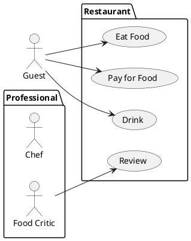
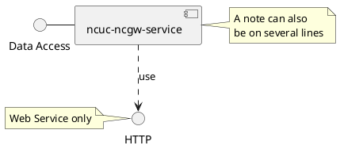
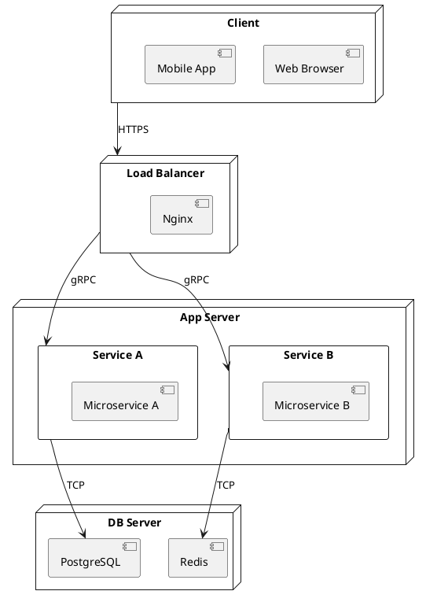
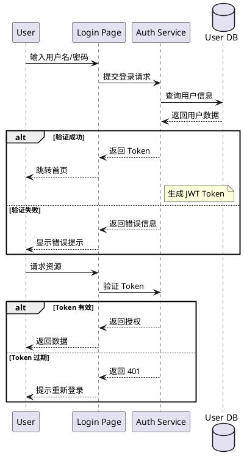
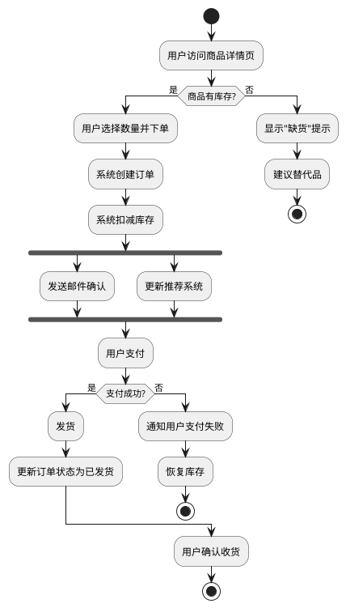
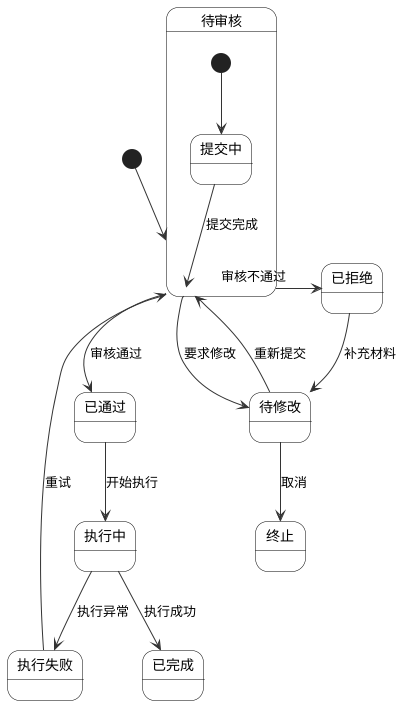
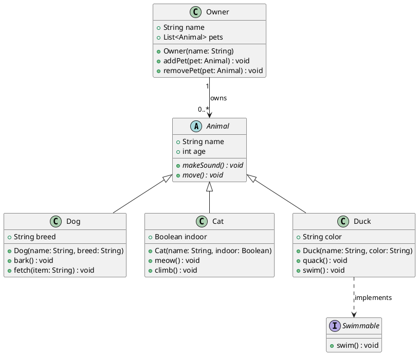
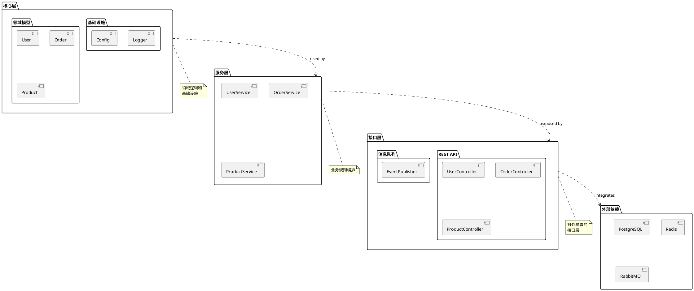

# 又一个文本UML设计工具-PlantUML

## 1. 前言

PlantUML 是一个开源工具，允许使用简单的文本描述语言来快速绘制 UML 图。它支持 UML 标准中的多种图表类型，包括用例图、类图、对象图、序列图、组件图、部署图、状态图、活动图、定时图和需求图。PlantUML 的官网是 https://plantuml.com，提供丰富的文档和社区支持。

PlantUML 的核心特点包括：
- **纯文本定义**：UML 图通过简洁的文本代码描述，易于版本管理和协作。
- **多输出格式**：支持生成 PNG、SVG、PDF、PlantStory 等多种格式。
- **丰富的图表类型**：覆盖 UML 标准中的核心图表类型。
- **与开发工具深度集成**：支持在 Visual Studio Code、IntelliJ IDEA、Eclipse 等 IDE 中直接使用，也可通过 LaTeX（With LaTeX）、Confluence、GitHub 等集成。

在 AI 编程时代，文本方式设计 UML 的优势更加凸显：
- **AI 友好**：大语言模型擅长理解和生成文本，用自然语言描述即可自动生成 UML 图，无需手动拖拽。
- **高效迭代**：修改文本代码即可更新图表，比图形化工具更快。
- **版本控制友好**：纯文本格式易于 Git 管理，差分清晰。
- **模板化与复用**：可以创建模板和宏，快速生成常用模式。

与 Mermaid 对比：
- **优势**：PlantUML 支持的 UML 类型更多（如部署图、状态图的精细控制），语法表达能力更强，图表定制更灵活，社区中有很多现成的宏库（如 Arc4UT、JMRTD）。
- **劣势**：Mermaid 在 GitHub 和 GitLab 中原生支持，无需额外插件即可渲染；Mermaid 的学习曲线更平缓，语法更接近自然语言；PlantUML 依赖于 Java 运行时和插件支持。

## 2. 用例图

用例图用于描述系统的外部参与者与系统功能之间的关系，帮助理解系统的功能边界和用户需求。

用例图展示了餐厅系统中的参与者（顾客、厨师、美食评论家）与系统功能（用餐、付款、饮酒、评价）之间的关系。参与者通过箭头指向其交互的用例，清晰表达了不同角色的功能需求。

## 3. 组件图

组件图描述系统的物理组件及其相互关系，展示系统的模块化和依赖结构。

组件图展示了"Data Access"接口与 `ncuc-ncgw-service` 组件之间的实现关系，以及该组件对 HTTP 协议的依赖。注释说明 Web Service 的用途和组件的说明。组件图有助于理解系统的模块划分和依赖方向。

## 4. 部署图

部署图用于描述系统运行时硬件和软件的物理部署结构，展示计算节点、设备和它们之间的连接关系。

部署图展示了一个典型的三层架构：客户端层（Web 浏览器和移动应用）、应用服务器层（微服务 A/B）和数据存储层（PostgreSQL 和 Redis），通过负载均衡器（Nginx）分发请求。

## 5. 时序图

时序图（又称序列图）描述对象之间消息传递的时间顺序，展现交互过程中的生命周期。

时序图展示了一个完整的用户登录流程：用户输入凭据后，系统验证身份并返回 Token，后续请求基于 Token 进行授权。通过 `alt` 片段处理成功和失败两种分支，清晰表达了交互的时间顺序和条件逻辑。

## 6. 活动图

活动图描述业务流程或算法的工作流程，类似于流程图，支持并行分支和合并。

活动图展示了电商下单流程：从库存检查到创建订单，再到并行执行的通知和推荐任务，最后处理支付和发货逻辑。通过 `if/else` 和 `fork` 结构清晰地表达了条件判断和并行处理。

## 7. 状态图

状态图描述单个对象在其生命周期内经历的状态和状态之间的转换。

状态图描述了一个审核流程的状态流转：从初始的"待审核"状态开始，经过"已通过"、"已拒绝"、"待修改"等状态，最终到达终止状态。其中包含了循环逻辑（执行失败可重试）和多个终止路径。

## 8. 类图

类图描述系统中类的静态结构，包括类的属性、方法以及类之间的关系（继承、实现、关联、聚合、组合、依赖）。

类图展示了一个宠物管理系统的核心类结构：`Animal` 作为抽象基类，定义了通用属性和方法；`Dog`、`Cat`、`Duck` 分别继承动物类并实现各自特有的行为；`Swimmable` 接口被 `Duck` 实现；`Owner` 类通过聚合关系管理多个宠物。这展示了继承、实现和聚合等多种 UML 关系。

## 9. 包图

包图描述软件系统的模块划分和包之间的依赖关系，帮助组织大型代码库的结构。

包图展示了一个典型分层架构的模块组织：核心层包含领域模型和基础设施，服务层负责业务规则编排，接口层暴露 REST API 和消息队列接口，外部依赖包括数据库、缓存和消息中间件。包之间的依赖箭头清晰表达了分层架构的单向依赖原则。

## 10. 结束语

PlantUML 作为一个成熟的文本 UML 工具，凭借其简洁的语法和强大的图表生成能力，在软件开发中发挥着重要作用。尤其在 AI 编程日益普及的今天，文本形式的 UML 设计能够与 AI 工具无缝协作——开发者只需用自然语言描述需求，即可自动生成准确的 UML 图，大幅提升了设计效率和沟通效果。无论是小型团队快速原型设计，还是大型企业进行系统架构文档化，PlantUML 都是一个值得尝试的工具。