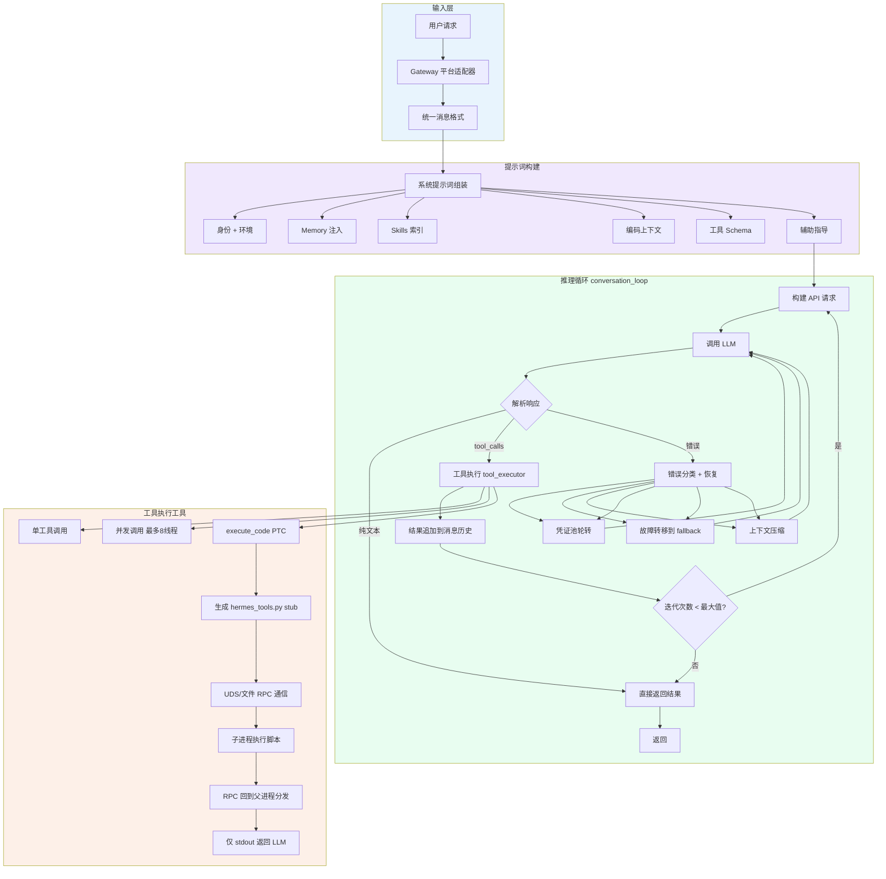

# Hermes Agent执行流程

## 1. 执行流程描述

### 整体架构

Hermes Agent 的推理循环建立在三个核心模块之上：

- **`run_agent.py`** — AIAgent 主类，负责初始化、凭证管理、上下文组装、调用 `conversation_loop.py` 的核心循环
- **`agent/conversation_loop.py`** — 约 4900 行的 `run_conversation()` 函数，驱动单次用户请求的完整生命周期（模型调用 → 工具调度 → 重试/故障转移 → 上下文压缩 → 返回）
- **`agent/tool_executor.py`** — 工具执行核心，支持顺序和并发两种执行模式（最多 8 个并行 worker 线程）

### 完整执行链路

```
┌─────────────┐
│   用户输入    │  (CLI / Telegram / Discord / Slack / API Server 等)
└──────┬──────┘
       │
       ▼
┌─────────────────────────────────────────────────────────┐
│  Gateway 层                                           │
│  - 接收各平台消息，统一格式化为 Hermes 内部消息结构        │
│  - 流式输出控制（draft/edit/off 模式）                   │
│  - 媒体交付（图片/文件上传下载）                           │
└──────────────────────┬──────────────────────────────────┘
                       │
                       ▼
┌─────────────────────────────────────────────────────────┐
│  系统提示词构建 (prompt_builder.py)                      │
│                                                         │
│  每次对话启动时动态组装:                                  │
│  1. 基础身份 (DEFAULT_AGENT_IDENTITY)                     │
│  2. 环境信息 (WSL/Linux/Mac, Python版本, 当前目录)       │
│  3. Memory 注入 (持久化记忆, 默认 2200 字符预算)          │
│  4. Skills 索引 (扫描 ~/.hermes/skills/, 注入 description) │
│  5. 编码上下文 (AGENTS.md / CLAUDE.md / .cursorrules)     │
│  6. 工具定义 (所有注册工具的 JSON Schema)                  │
│  7. 辅助指导 (任务完成准则 / 并行工具调用指南 / 执行纪律)   │
│                                                         │
│  SKILL.md 加载分两层:                                    │
│  - 系统层: 注入 description (不注入全文, 节省上下文)       │
│  - 按需层: 斜杠命令触发时加载完整内容 (放在 user message   │
│    中而非 system prompt, 保持 prompt caching 有效)       │
└──────────────────────┬──────────────────────────────────┘
                       │
                       ▼
┌─────────────────────────────────────────────────────────┐
│  LLM 推理循环 (conversation_loop.py)                     │
│                                                         │
│  ┌─── 迭代 1 ───────────────────────────────────────┐    │
│  │ 1. 构建 API 请求 (OpenAI 格式消息 + 工具 Schema)   │    │
│  │    - apply_anthropic_cache_control (Prompt 缓存)    │    │
│  │    - 注入 llm_request_middleware 元数据             │    │
│  │ 2. 调用 LLM (支持 20+ 提供商: OpenRouter/Anthropic/ │    │
│  │    OpenAI/Gemini/DeepSeek/本地模型等)               │    │
│  │ 3. 解析响应:                                       │    │
│  │    a. 纯文本 → 直接返回, 结束本轮                    │    │
│  │    b. tool_calls → 进入工具执行                     │    │
│  │    c. 错误 → classify_api_error 分类 + 恢复        │    │
│  └──────────────────────────────────────────────────┘    │
│                                                         │
│  工具执行分支:                                            │
│  ├── 单工具调用 → tool_executor → handler 执行           │
│  ├── 多工具调用 → 并发执行 (最大 8 线程, 独立工具并行)    │
│  │         → 收集所有结果 → 追加到消息历史 → 继续循环     │
│  └── execute_code (程序化工具调用 PTC):                  │
│      → 生成 hermes_tools.py stub 模块                    │
│      → UDS (Unix Domain Socket) 或文件 RPC 通信          │
│      → 子进程执行 LLM 生成的 Python 脚本                 │
│      → 脚本内调用工具 → RPC 回到父进程分发               │
│      → 仅将 stdout 返回 LLM (中间结果不进入上下文)        │
└──────────────────────┬──────────────────────────────────┘
                       │
                       ▼
┌─────────────────────────────────────────────────────────┐
│  错误恢复与恢复机制                                      │
│                                                         │
│  内置多层容错:                                           │
│  1. api_max_retries (默认 3) — 应用层递增退避重试         │
│  2. 凭证池轮转 — 单个 API Key 触发 429 时自动切下一个    │
│  3. 故障转移 — rate_limit / 连接超时 → 切 fallback      │
│     provider (可配置多提供商优先级)                        │
│  4. context_overflow (413) — 自动压缩历史并重试           │
│  5. prompt_caching — Gemini/Anthropic/Claude 各适配       │
└──────────────────────┬──────────────────────────────────┘
                       │
                       ▼
┌─────────────────────────────────────────────────────────┐
│  上下文压缩 (context_compressor.py)                      │
│                                                         │
│  接近 token 限制时自动触发:                               │
│  - compression.threshold: 0.50 (默认, 50% 时触发)        │
│  - compression.target_ratio: 0.20 (目标保留 20%)          │
│  - agent/context_engine.py: 插件化引擎 (默认 compressor)  │
│  - 关闭模式: 遇到 overflow 报错, 提示 /compress 或 /new   │
└──────────────────────┬──────────────────────────────────┘
                       │
                       ▼
┌─────────────────────────────────────────────────────────┐
│  工具结果返回给用户                                       │
│  - 工具输出追加到对话历史                                 │
│  - 持久化到 SQLite + FTS5 (state.db)                    │
│  - 通过 Gateway 格式化为对应平台的消息                      │
│  - 流式输出时实时编辑/追加                                │
└─────────────────────────────────────────────────────────┘
```

### execute_code 子流程详解

`execute_code` 是 Hermes Agent 的「程序化工具调用 (Programmatic Tool Calling, PTC)」机制，允许 LLM 编写一个完整的 Python 脚本，在一个推理轮次内完成多步工具调用：

```
LLM 生成 Python 脚本
       │
       ▼
┌─────────────────────────┐     ┌─────────────────────────┐
│  父进程 (推理循环)        │     │  子进程 (脚本执行)       │
│                         │     │                         │
│  1. 生成 hermes_tools.py │     │  1. import hermes_tools │
│     (RPC stub 模块)      │◄────┤     (工具调用)          │
│     UDS 或文件传输       │ RPC │                         │
│                         │     │  2. 调用 tool() 函数     │
│  2. 监听 RPC 请求        │     │                         │
│                         │     │  3. script stdout 输出   │
│  3. 收到 RPC 调用        │     │                         │
│     → 分发对应工具       │     │  4. 脚本结束            │
│     → 获取结果写回 RPC   │     │                         │
│                         │     └─────────────────────────┘
│  4. 脚本完成后读取 stdout │
│     (默认 50KB 限制)      │
│                         │
│  5. 将 stdout 返回 LLM  │
└─────────────────────────┘
```

核心限制：sandbox 内默认允许 7 个工具 (web_search, web_extract, read_file, write_file, search_files, patch, terminal)，超时 300 秒，最多 50 次工具调用。

### Mermaid 流程图



## 2. 关键代码

### 2.1 核心对话循环

`agent/conversation_loop.py` 中的 `run_conversation()` 函数（约 4900 行），是 Hermes Agent 的心脏。核心结构如下：

```python
# conversation_loop.py — 核心循环骨架
def run_conversation(agent):
    """
    驱动一次用户请求的完整生命周期。
    大致流程: 模型调用 → 工具调度 → 重试/恢复 → 压缩 → 返回
    """
    # 1. 初始化迭代预算
    iteration_budget = IterationBudget(
        max_turns=agent.api_max_retries  # 默认 3 次重试
    )
    
    while True:
        # 2. 调用 LLM (OpenAI 格式消息 + 工具 Schema)
        api_kwargs = agent._build_api_kwargs(api_messages)
        response = agent._interruptible_api_call(api_kwargs)
        
        # 3. 解析响应
        if response.has_tool_calls():
            # 4. 工具执行
            results = agent._execute_tool_calls(response.tool_calls)
            # 5. 结果追加到消息历史
            messages.extend(results)
            continue  # 继续循环
        
        if response.is_text():
            return response.text  # 直接返回
        
        if response.is_error():
            # 6. 错误分类 + 恢复策略
            error_type = classify_api_error(response.error)
            # 触发凭证池轮转 / 故障转移 / 上下文压缩
            apply_recovery(error_type)
```

### 2.2 工具执行核心

`agent/tool_executor.py` 支持顺序和并发两种执行模式：

```python
# tool_executor.py — 工具执行核心
_MAX_TOOL_WORKERS = 8  # 最大并发 worker 线程数

def _execute_tool_calls_sequential(agent, tool_calls):
    """顺序执行 — 有依赖关系时"""
    results = []
    for call in tool_calls:
        result = _dispatch_single_tool(agent, call)
        results.append(result)
    return results

def _execute_tool_calls_concurrent(agent, tool_calls):
    """并发执行 — 独立工具并行调用"""
    with concurrent.futures.ThreadPoolExecutor(
        max_workers=_MAX_TOOL_WORKERS
    ) as executor:
        futures = {
            executor.submit(_dispatch_single_tool, agent, call): call
            for call in tool_calls
        }
        results = []
        for future in concurrent.futures.as_completed(futures):
            results.append(future.result())
    return results
```

### 2.3 execute_code — 程序化工具调用 (PTC)

`tools/code_execution_tool.py` 实现了一个 RPC 机制，让 LLM 在单次推理轮次内完成多步工具调用：

```python
# code_execution_tool.py — PTC 核心
SANDBOX_ALLOWED_TOOLS = frozenset([
    "web_search", "web_extract", "read_file", "write_file",
    "search_files", "patch", "terminal",
])

DEFAULT_TIMEOUT = 300        # 5 分钟
DEFAULT_MAX_TOOL_CALLS = 50
MAX_STDOUT_BYTES = 50_000    # 50 KB
MAX_STDERR_BYTES = 10_000    # 10 KB

# 两种传输方式:
# 1. 本地后端: Unix Domain Socket (UDS)
#    父进程生成 hermes_tools.py stub → 监听 UDS → 子进程执行脚本
#    → 工具调用通过 UDS RPC 回到父进程分发
#
# 2. 远程后端: 文件 RPC
#    生成文件 RPC stub → 子进程写请求文件 → 父进程轮询读取
#    → 分发工具 → 写响应文件 → 子进程轮询读取响应

def _execute_local(script_code, timeout=DEFAULT_TIMEOUT):
    """本地执行 — UDS 传输"""
    # 1. 生成 hermes_tools.py (RPC stub)
    stub_module = generate_hermes_tools_stub(SANDBOX_ALLOWED_TOOLS)
    
    # 2. 启动 UDS RPC 监听
    sock = socket.socket(socket.AF_UNIX, socket.SOCK_STREAM)
    sock.bind(tempfile.mktemp())
    sock.listen(1)
    
    # 3. 子进程执行脚本
    proc = subprocess.run(
        [sys.executable, "-c", script_code],
        stdout=subprocess.PIPE,
        stderr=subprocess.PIPE,
        timeout=timeout
    )
    
    # 4. 返回 stdout (限制 50KB)
    return proc.stdout[:MAX_STDOUT_BYTES]
```

### 2.4 系统提示词构建

`agent/prompt_builder.py` 负责动态组装每次对话的系统提示词：

```python
# prompt_builder.py — 系统提示词组装
def _build_system_prompt(agent, cwd):
    """动态拼装系统提示词: 身份 + 环境 + 记忆 + Skills + 工具 + 指导"""
    pieces = []
    
    # 1. 基础身份
    pieces.append(DEFAULT_AGENT_IDENTITY)
    # "You are Hermes Agent, an intelligent AI assistant created by Nous Research..."
    
    # 2. Memory 注入
    pieces.append(build_memory_context_block(agent))
    # 持久化记忆, 默认 2200 字符预算
    
    # 3. Skills 索引 (注入 description, 不注入全文)
    pieces.append(build_skills_system_prompt(agent))
    # 扫描 ~/.hermes/skills/, 注入每个 skill 的 description
    
    # 4. 编码上下文 (AGENTS.md / CLAUDE.md / .cursorrules)
    hermes_md = _find_hermes_md(Path(cwd))
    if hermes_md:
        pieces.append(_strip_yaml_frontmatter(hermes_md.read_text()))
    
    # 5. 工具定义 (所有注册工具的 JSON Schema)
    pieces.append(build_tools_system_prompt(agent))
    
    # 6. 辅助指导
    pieces.append(TASK_COMPLETION_GUIDANCE)
    # "When the user asks you to build... deliverable is a working artifact..."
    pieces.append(PARALLEL_TOOL_CALL_GUIDANCE)
    # "When you need several pieces of information that don't depend on
    #  each other, request them together in a single response..."
    
    return "\n\n".join(pieces)
```

### 2.5 凭证池轮转与故障转移

```python
# agent/credential_pool.py — 多 API Key 自动轮转
class CredentialPool:
    """API Key 池, 触发 429 时自动切换到下一个"""
    def __init__(self, keys):
        self._keys = keys
        self._index = 0
    
    def next(self):
        """轮转到下一个 key"""
        key = self._keys[self._index]
        self._index = (self._index + 1) % len(self._keys)
        return key
    
    def on_rate_limit(self):
        """429 时跳过此 key, 保留轮转位置"""
        pass  # 实际实现会标记此 key 为 rate-limited

# agent/conversation_loop.py — 故障转移链
def _try_activate_fallback(agent):
    """当前 provider 耗尽时, 切换到 fallback provider"""
    fallback_provider = agent.config.get("fallback_providers")
    if fallback_provider:
        agent.switch_provider(fallback_provider)
        return True
    return False
```

### 2.6 上下文压缩

```python
# agent/context_compressor.py — 有损摘要压缩
def compress_conversation(messages, target_ratio=0.20):
    """
    当上下文接近 token 限制时自动触发。
    通过摘要替换早期消息, 保留关键信息。
    """
    if len(messages) < 2:
        return messages  # 太少不用压缩
    
    # 保留最近 N 条, 压缩前面的
    keep_count = max(1, int(len(messages) * target_ratio))
    compressed = []
    for msg in messages[:-keep_count]:
        compressed.append(summary_message(msg))  # 摘要版本
    compressed.extend(messages[-keep_count:])   # 保留原版
    return compressed
```

## 3. 结束语

Hermes Agent 的执行流程是一个精心设计的多层系统：

**分层解耦** — 从 Gateway 平台适配、系统提示词动态组装、LLM 推理循环、工具执行调度到错误恢复，每一层职责清晰、边界明确。核心对话循环 `run_conversation()` 约 4900 行，但内部通过小函数组合（凭证轮转、错误分类、上下文压缩等）保持可维护性。

**智能路由** — 工具选择不是硬编码的路由规则，而是依靠 LLM 的语义理解能力。系统将工具定义（JSON Schema）、Skills 索引、编码上下文都注入到系统提示词中，让 LLM 自行判断何时使用什么工具。这也是为什么工具描述（description）越清晰，LLM 调用越准确。

**PTC 优化** — `execute_code` 的 PTC 机制是 Hermes Agent 的一大特色。LLM 可以一次性写出多步工具调用脚本，通过 UDS RPC 或文件 RPC 在子进程中执行，将原本需要 N 轮推理的链式调用压缩为 1 轮，大幅减少 token 消耗和延迟。

**容错设计** — 内置凭证池自动轮转、多提供商故障转移、上下文自动压缩、prompt 缓存管理等多层容错机制。API Key 触发 429 时自动切下一个 provider，不中断用户；上下文接近限制时自动触发摘要压缩；系统提示词通过 prefix caching 实现安装时一次构建、全局复用。

**自我进化** — Skills 机制让 Agent 从经验中学习。每次解决复杂问题、发现高效工作流或得到用户纠正后，可以持久化为 SKILL.md 文件，在后续会话中自动加载。配合持久化 Memory（SQLite + FTS5），Agent 能记住用户偏好、环境细节和已验证的工作方法，越用越顺手。

---

*本文基于 Hermes Agent 源码 v2.x 编写，涉及的核心文件：`run_agent.py`、`agent/conversation_loop.py`、`agent/prompt_builder.py`、`agent/tool_executor.py`、`tools/code_execution_tool.py`、`agent/context_compressor.py`、`agent/credential_pool.py`。*
