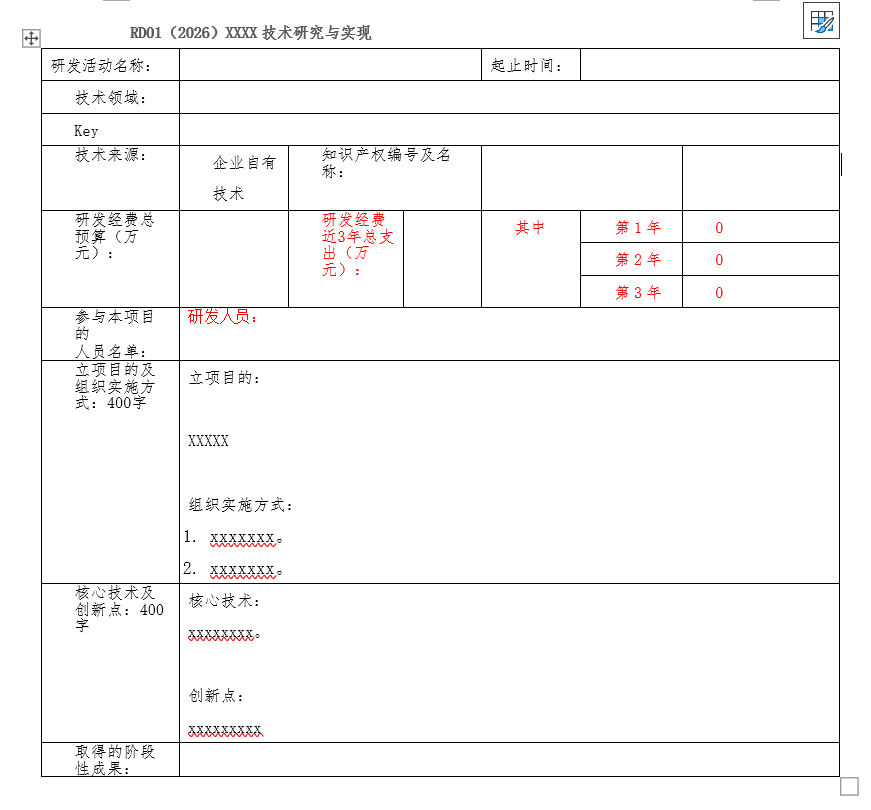

# Hermes-使用learn命令学习生成RD技能并使用技能自动编写RD文档

## 1. 前言

Hermes Agent 在较新版本中引入了 **`/learn`** 命令，这是一个快速将已有知识转化为可复用技能的利器。它的主要作用是：

**将任意来源的资料蒸馏成标准化的 Hermes 技能（Skill）。** `/learn` 是一个开放式命令——你只需指明想让它学什么（一个目录、一个 URL、一段笔记，或者你刚刚在终端里走过的整个工作流），它就会自动调用自身的工具去收集材料，然后按照 Hermes 的 SKILL.md 规范撰写出一篇结构化的技能文档（包括 ≤60 字描述、标准章节顺序、Hermes 工具调用框架，且不编造命令）。

这个命令支持多种输入方式：本地目录或文件（通过 `read_file` / `search_files` 读取）、远程 URL（通过 `web_fetch` 拉取）、对话中刚刚走过的完整工作流（agent 自带记忆），甚至是粘贴的文字笔记。它可以在 CLI、消息网关（Telegram / Discord / Slack 等）、TUI 和 Dashboard 的 Skills 页面中使用。

通过 `/learn`，我们不再需要手动编写技能文档。对于 RD 申报这种有固定格式的重复性工作，只需让 agent 学习一次 Word 模板或历史文档，之后每次申报时加载该技能即可自动生成文档，省去大量人工排版和文字工作。本文接下来将展示完整的从学习 RD 技能到自动编写新文档的实操流程。

## 2. 从已有RD文档提炼出RD技能

十年来我们一直在这个word文档中编写，有一个固定表格，如图:  

上面只是把真实一个RD文档的内容删除掉了，实际使用/learn来学习的RD文档是具有真实内容的，我们在hermes cli里一个/learn命令就可以生成一个RD技能。


## 3. 使用RD技能自动编写新RD文档

最近我开发一个地址匹配服务程序，解决用户随意输入五花八门的不合格的地址问题，需要同步编写一个RD文档去申报，以前肯定是需要在word文档里很苦逼地一个个手写了，现在直接在hermes chat命令上:
```
❯ 我要写一个rd01, 保存文件到: ./mywiki/design/rdip/rd01.md
❯ 活动名称：地址匹配服务技术研究与应用
❯ 先写一个rd01.md文件吧
❯ 这个项目的源代码和文档仓库是: ./ai/address_matching, 对这个仓库里所有源代码和目录进行分析、归纳总结，然后根据rd模版来编写立项目的、核心技术、创新点。
❯ 起止时间：2026-01-01 ~ 2026-03-31
❯ 研发人员: XXX
❯ 取得的阶段性成果：在XXXXX分析系统中使用了本技术提供的服务，很好地解决了用户各种地址格式识别和匹配。
```
就是这几句话，hermes根据RD技能里模版格式，分析我的address_matching系统代码和文档，然后就能自动写一篇漂亮的RD文档来，我看了之后，至少比我手工写得好。
还有，我们AI coding尽量不要采用vibing coding这种口水化的方式全程编程，vibing coding做做事后小bugfix还可以，大规模功能实现一定要采用spec coding这种预先写好功能细节描述和实现细节规定，在usecase.md文档里已经留下了丰富的文本内容，之后用AI来自动处理文档就方便了，是基于真实数据的，比如RD文档、IP相关文档等，都非常方便。 
